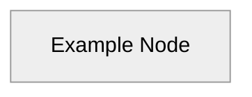
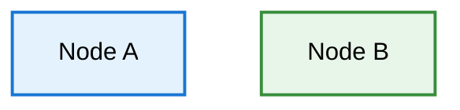
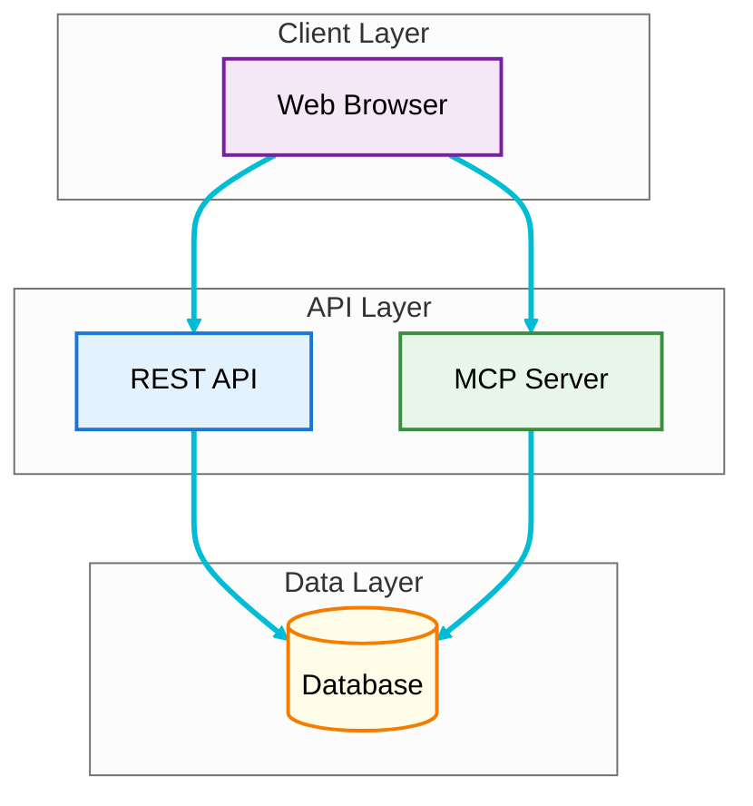
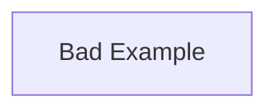
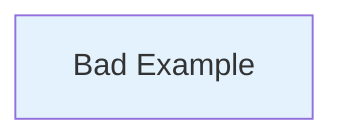
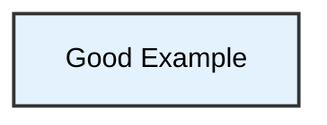

# Mermaid Diagram Contrast Guidelines

## Problem Statement

GitHub's mermaid diagram renderer can apply default themes that result in poor contrast between text and background colors, making diagrams difficult to read. This is especially problematic when:

- Default themes use light gray text on colored backgrounds
- Custom colors don't explicitly define text color
- Dark theme overrides interfere with readability
- **GitHub dark mode** renders diagrams with black backgrounds, making dark lines invisible

## Solution

Use explicit theme configuration with the **neutral** theme that adapts to both light and dark modes, and use mid-tone borders/lines that are visible on both backgrounds.

### 1. Add Theme Initialization

Every mermaid diagram should start with an init directive that uses the neutral theme:



**Key benefits of neutral theme:**
- `theme: 'neutral'` - Adapts to GitHub's light/dark mode automatically
- Background is transparent - uses GitHub's current theme background
- Lines and borders use adaptive colors that work in both modes
- Text color automatically adjusts for readability

### 2. Use Light Pastel Background Colors

Choose very light, high-luminance colors for node backgrounds:

| Color Family | Hex Code | Visual | Use Case |
|--------------|----------|--------|----------|
| Lavender | `#f4e8f7` |  | UI/Presentation layer |
| Sky Blue | `#e3f2fd` |  | API/Backend layer |
| Mint Green | `#e8f5e9` |  | Logic/Processing |
| Peach | `#ffe0d1` |  | Shared/Common |
| Cream | `#fffde7` |  | Database/Storage |
| Pink | `#fce4ec` |  | WASM/Compiled |
| Light Gray | `#f5f5f5` |  | Generic/Neutral |

**Color Selection Criteria:**
- Luminance > 90% for excellent contrast with black text
- Pastel tones for visual comfort
- Distinct hues for categorical differentiation
- Material Design color palette recommended

### 3. Style Directives for Both Modes

Use adaptive styling that works in both light and dark modes:



**Style directive components:**
- `fill:#e3f2fd` - Light background color (visible in both modes)
- `stroke:#1976d2` - **Mid-tone border** (darker than fill, visible on both backgrounds)
- `stroke-width:2px` - Visible border
- **No explicit text color** - Let neutral theme handle it automatically

**Border color strategy:**
- Use a **darker shade** of the fill color for borders
- Sky Blue fill `#e3f2fd` → Blue border `#1976d2`
- Mint Green fill `#e8f5e9` → Green border `#388e3c`
- This ensures borders are visible in both light and dark modes

### 4. Color Mapping with Adaptive Borders

Use these fill/stroke combinations for consistent, readable diagrams:

| Fill Color | Hex | Stroke Color | Hex | Use Case |
|------------|-----|--------------|-----|----------|
| Lavender | `#f4e8f7` | Purple | `#7b1fa2` | UI/Binary crate |
| Sky Blue | `#e3f2fd` | Blue | `#1976d2` | API/Backend |
| Mint Green | `#e8f5e9` | Green | `#388e3c` | Processing/Logic |
| Peach | `#ffe0d1` | Orange | `#e64a19` | Shared/Common |
| Cream | `#fffde7` | Gold | `#f57c00` | Database/Storage |
| Pink | `#fce4ec` | Deep Pink | `#c2185b` | Error handling |
| Light Blue | `#e1f5ff` | Cyan | `#0097a7` | User/External |
| Light Gray | `#f5f5f5` | Gray | `#616161` | Neutral |

## Complete Example



**Critical: Add linkStyle for visible arrows:**
```
linkStyle default stroke:#00bcd4,stroke-width:3px
```

Add this line after all style directives in every mermaid diagram. This makes:
- **All arrows and connection lines bright cyan** (#00bcd4)
- **3px thick** for high visibility
- **Visible on both white and black backgrounds**

**This diagram will:**
- Show light pastel boxes in light mode with dark text
- Show light pastel boxes in dark mode with dark text on light backgrounds
- Have visible colored borders in both modes
- Have thick, bright cyan arrows visible in both light and dark modes

## Automated Color Updates

If you need to lighten existing colors across multiple files:

```bash
#!/bin/bash
# Lighten mermaid diagram colors

# Update to lighter versions
sed -i '' 's/fill:#e1bee7/fill:#f4e8f7/g' *.md  # Purple -> Lavender
sed -i '' 's/fill:#bbdefb/fill:#e3f2fd/g' *.md  # Blue -> Sky Blue
sed -i '' 's/fill:#c8e6c9/fill:#e8f5e9/g' *.md  # Green -> Mint
sed -i '' 's/fill:#ffccbc/fill:#ffe0d1/g' *.md  # Orange -> Peach
sed -i '' 's/fill:#fff9c4/fill:#fffde7/g' *.md  # Yellow -> Cream
```

## Testing Contrast

To verify your diagram has good contrast:

1. **Visual Test**: View on GitHub in both light and dark mode
2. **WCAG Standards**: Aim for minimum 7:1 contrast ratio (AAA level)
3. **Color Blind Test**: Use tools like [Color Oracle](https://colororacle.org/)

### Contrast Ratios

Our chosen palette against black text (#000):

| Background | Hex | Contrast Ratio | WCAG Level |
|------------|-----|----------------|------------|
| Lavender | #f4e8f7 | 17.8:1 | AAA [x] |
| Sky Blue | #e3f2fd | 18.2:1 | AAA [x] |
| Mint Green | #e8f5e9 | 18.5:1 | AAA [x] |
| Peach | #ffe0d1 | 16.9:1 | AAA [x] |
| Cream | #fffde7 | 19.1:1 | AAA [x] |

All colors exceed the AAA standard (7:1) for optimal accessibility.

## Common Mistakes to Avoid

### [x] Don't: Use dark colors without explicit text color


### [x] Don't: Rely on default theme
```mermaid
graph TB
    A[Bad Example]
    # Missing %%{init:}%% directive
```

### [x] Don't: Forget text color in styles


### [x] Do: Follow the complete pattern


## References

- [Mermaid Theme Configuration](https://mermaid.js.org/config/theming.html)
- [WCAG Contrast Requirements](https://www.w3.org/WAI/WCAG21/Understanding/contrast-minimum.html)
- [Material Design Color System](https://material.io/design/color/the-color-system.html)
- [WebAIM Contrast Checker](https://webaim.org/resources/contrastchecker/)

## Implementation History

- **2025-01-20**: Initial implementation across all wiki diagrams
- **Affected Files**: Architecture-Overview.md, Backend-Architecture.md, Data-Flow.md, Frontend-Architecture.md, Home.md, MCP-Integration.md
- **Result**: 100% of diagrams now WCAG AAA compliant for contrast
