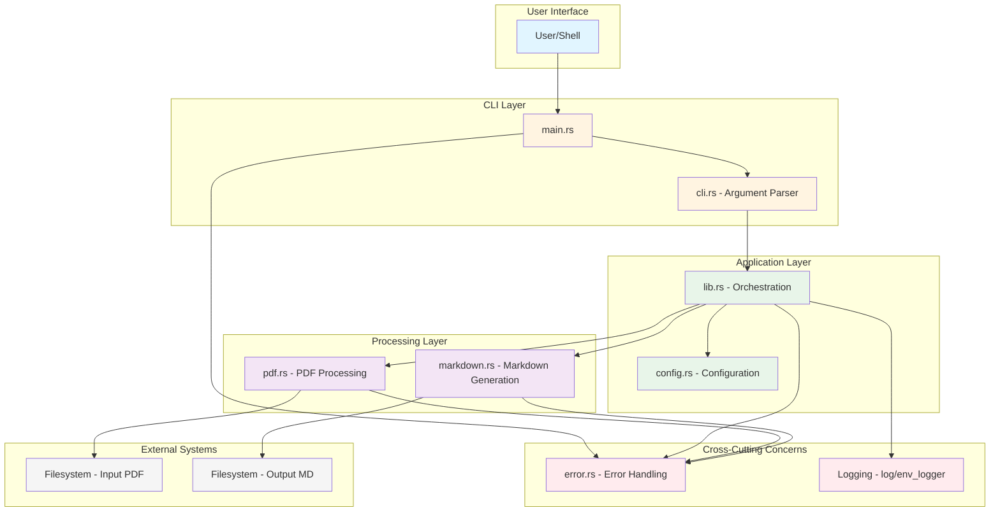
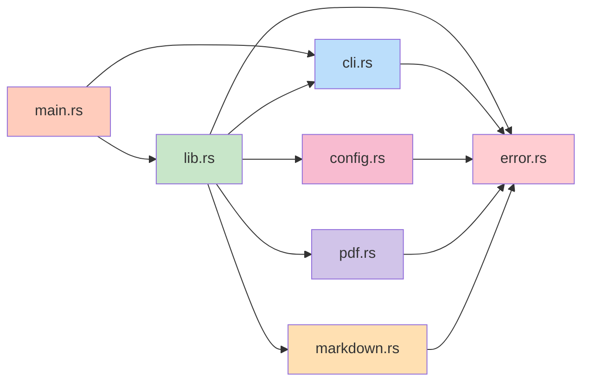
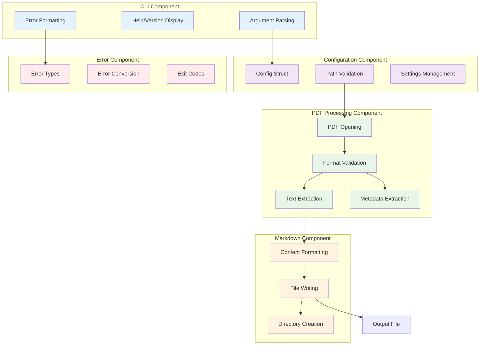
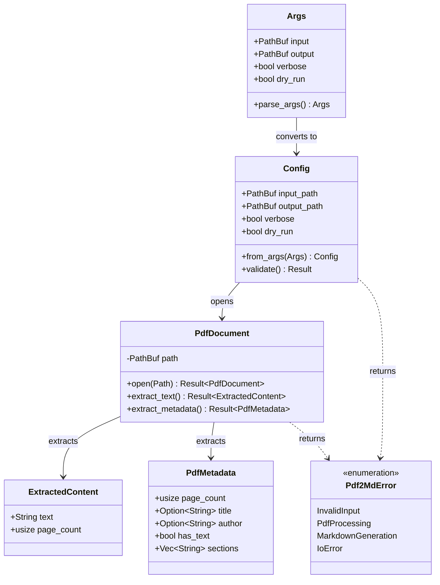
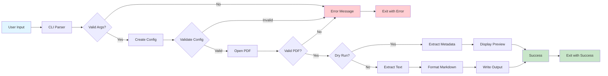
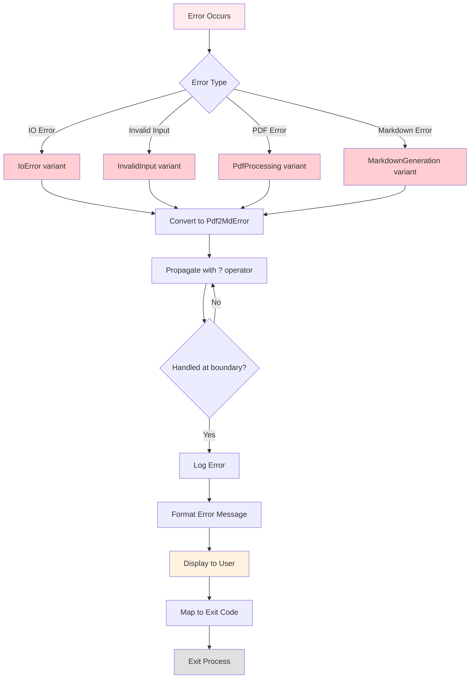
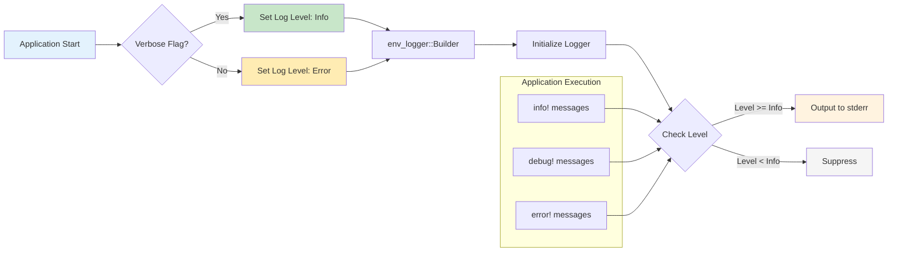
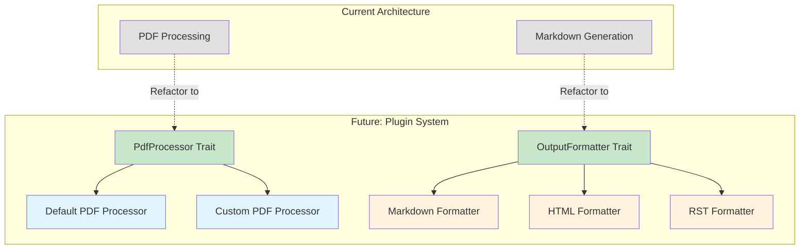

# Architecture Diagrams

This page provides visual representations of the pdf2md system architecture using Mermaid diagrams.

## System Architecture Block Diagram

The following diagram shows the high-level architecture layers and their relationships:

## Module Dependency Diagram

Shows the dependencies between modules:

## Component Architecture

Detailed view of component responsibilities:

## Data Structure Relationships

Key data structures and their relationships:

## Processing Pipeline

The data flow through the processing pipeline:

## Error Handling Flow

How errors propagate through the system:

## Logging Architecture

Logging flow based on verbosity settings:

## Future Extension Points

Planned extensibility architecture:

## Related Pages

- **[[Architecture-Overview]]** - Detailed architecture description
- **[[Data-Flow-Sequences]]** - Sequence diagrams for workflows
- **[[CLI-Component]]** - CLI component details
- **[[PDF-Processing-Component]]** - PDF processing details
- **[[Markdown-Generation-Component]]** - Markdown generation details
- **[[Error-Handling-Component]]** - Error handling details
