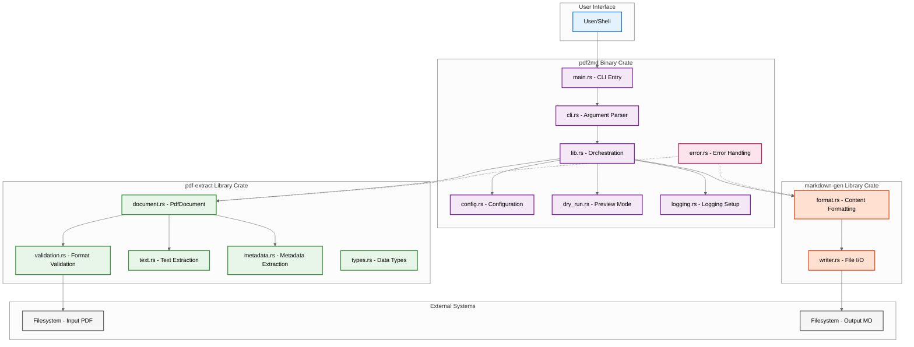
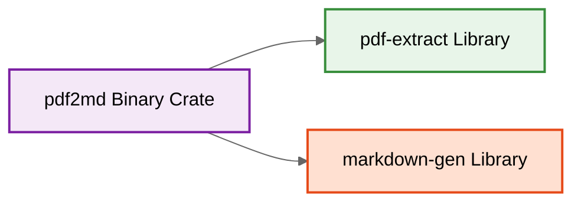
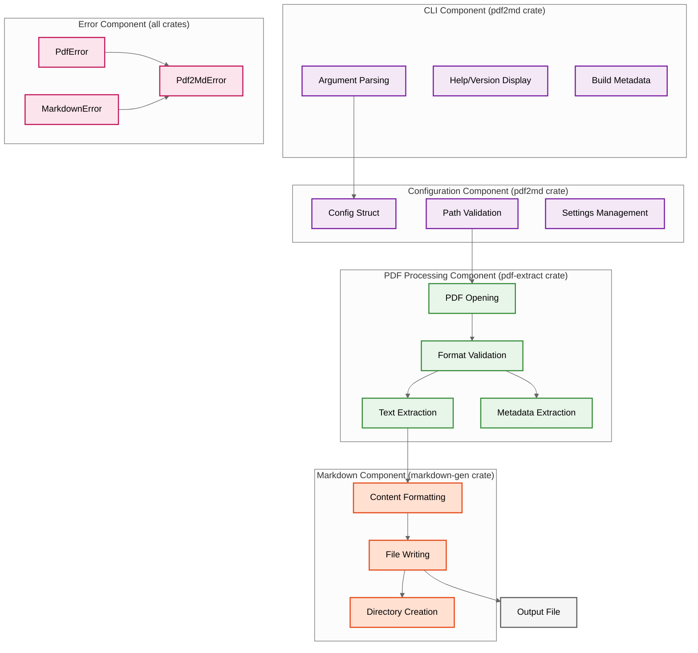
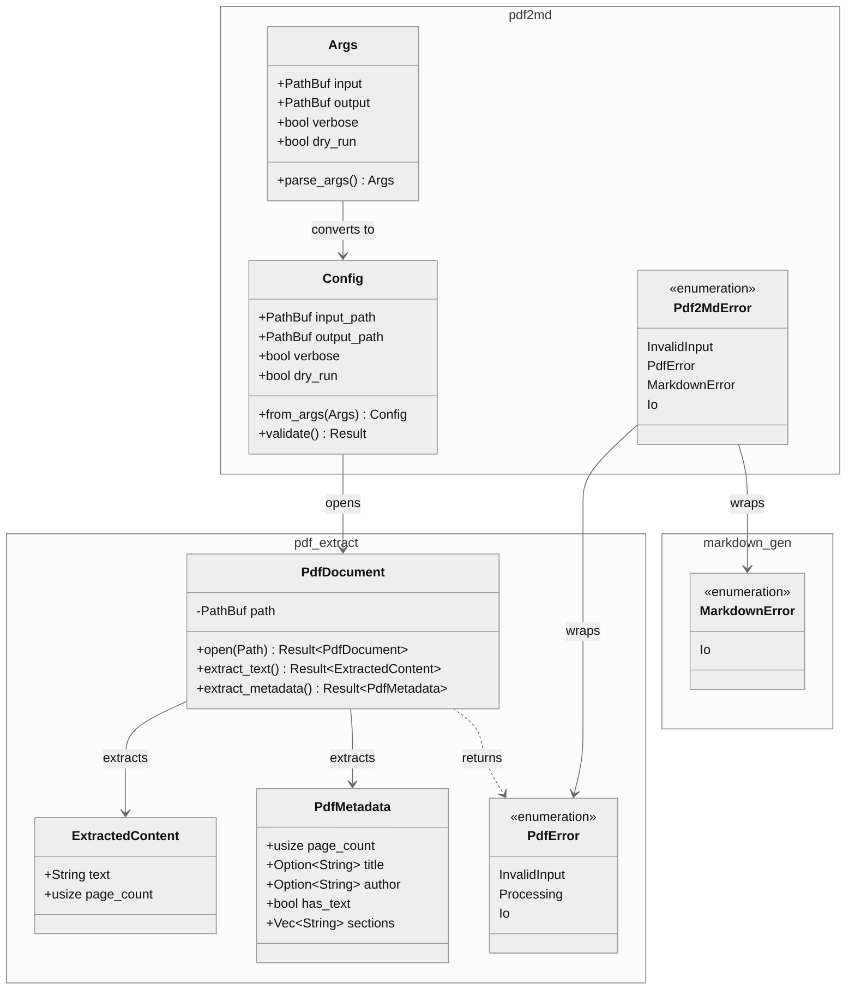
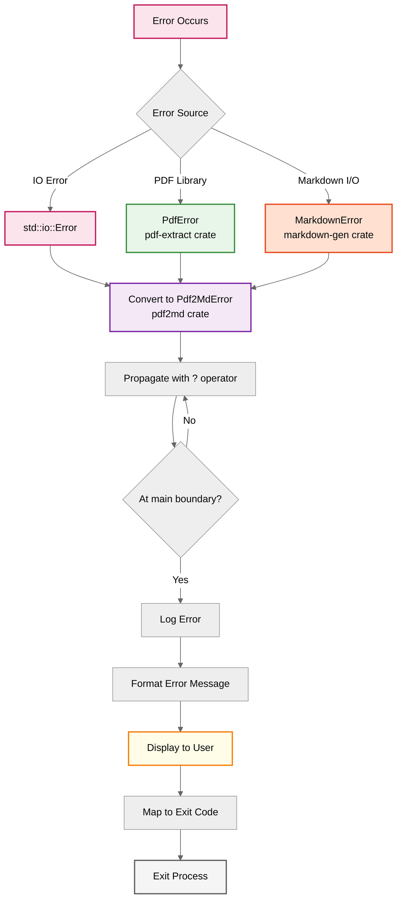
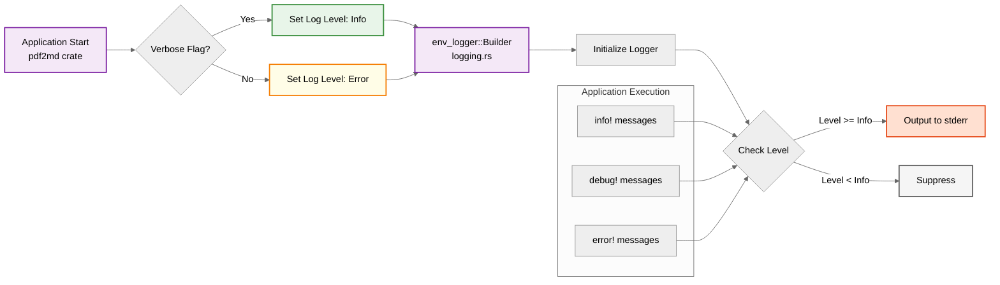
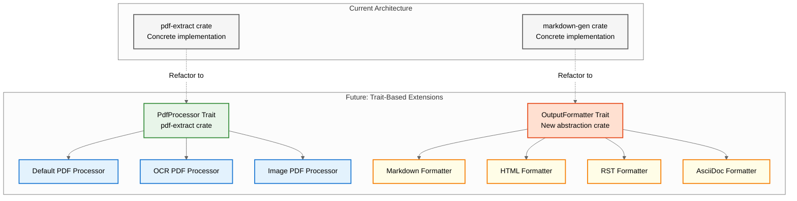

# Architecture Diagrams

This page provides visual representations of the pdf2md system architecture using Mermaid diagrams.

## Workspace Architecture Diagram

The following diagram shows the high-level workspace structure with three crates:

## Crate Dependency Diagram

Shows the dependencies between the three workspace crates:

**Key Points**:
- Binary crate depends on both libraries
- Libraries are independent of each other
- No circular dependencies

## Component Architecture

Detailed view of component responsibilities across workspace crates:

## Data Structure Relationships

Key data structures across the workspace:

## Processing Pipeline

The data flow through the processing pipeline across workspace crates:

```mermaid
%%{init: {'theme':'neutral'}}%%
flowchart LR
    A[User Input] --> B[CLI Parser<br/>pdf2md crate]
    B --> C{Valid Args?}
    C -->|No| D[Error Message]
    C -->|Yes| E[Create Config<br/>pdf2md crate]
    E --> F{Validate Config}
    F -->|Invalid| D
    F -->|Valid| G[validate_pdf<br/>pdf-extract crate]
    G --> H{Valid PDF?}
    H -->|No| D
    H -->|Yes| I{Dry Run?}
    I -->|Yes| J[Extract Metadata<br/>pdf-extract crate]
    I -->|No| K[Extract Text<br/>pdf-extract crate]
    J --> L[Display Preview]
    K --> M[Format Markdown<br/>markdown-gen crate]
    M --> N[Write Output<br/>markdown-gen crate]
    N --> O[Success]
    L --> O
    D --> P[Exit with Error]
    O --> Q[Exit with Success]

    style A fill:#e3f2fd,stroke:#1976d2,stroke-width:2px
    style B fill:#f4e8f7,stroke:#7b1fa2,stroke-width:2px
    style E fill:#f4e8f7,stroke:#7b1fa2,stroke-width:2px
    style G fill:#e8f5e9,stroke:#388e3c,stroke-width:2px
    style J fill:#e8f5e9,stroke:#388e3c,stroke-width:2px
    style K fill:#e8f5e9,stroke:#388e3c,stroke-width:2px
    style M fill:#ffe0d1,stroke:#e64a19,stroke-width:2px
    style N fill:#ffe0d1,stroke:#e64a19,stroke-width:2px
    style D fill:#fce4ec,stroke:#c2185b,stroke-width:2px
    style P fill:#fce4ec,stroke:#c2185b,stroke-width:2px
    style O fill:#e8f5e9,stroke:#388e3c,stroke-width:2px
    style Q fill:#e8f5e9,stroke:#388e3c,stroke-width:2px
    style L fill:#f5f5f5,stroke:#616161,stroke-width:2px
```

## Error Handling Flow

How errors propagate across workspace crates:

## Logging Architecture

Logging flow based on verbosity settings:

## Future Extension Points

Planned extensibility architecture for library crates:

## Related Pages

- **[[Architecture-Overview]]** - Detailed architecture description
- **[[Data-Flow-Sequences]]** - Sequence diagrams for workflows
- **[[CLI-Component]]** - CLI component details
- **[[PDF-Processing-Component]]** - PDF processing details
- **[[Markdown-Generation-Component]]** - Markdown generation details
- **[[Error-Handling-Component]]** - Error handling details
