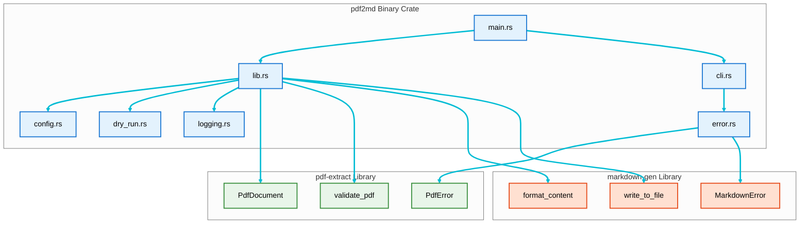

# Architecture Overview

## System Architecture

pdf2md follows a **modular, layered architecture** that separates concerns into distinct components. This design promotes maintainability, testability, and extensibility.

## Workspace Architecture

pdf2md is organized as a Cargo workspace with three crates:

1. **pdf-extract** - Library for PDF processing
2. **markdown-gen** - Library for Markdown generation
3. **pdf2md** - CLI binary that orchestrates the libraries

### Workspace Benefits

- **Reusability**: Libraries can be used independently by other projects
- **Modularity**: Clear separation between PDF processing, Markdown generation, and CLI concerns
- **Testability**: Each crate has focused test suites (37 tests total across workspace)
- **Maintainability**: Smaller, focused modules within each crate

## Crate Architecture

### 1. pdf-extract Library Crate

**Location**: `crates/pdf-extract/`

**Purpose**: Standalone library for extracting text and metadata from PDF documents

**Modules**:
- `document.rs` - PdfDocument struct and implementation
- `metadata.rs` - Metadata extraction functions
- `text.rs` - Text extraction from PDF pages
- `types.rs` - ExtractedContent, PdfMetadata structs
- `validation.rs` - PDF format validation
- `test_utils.rs` - Test fixture utilities

**Public API**:
```rust
pub fn validate_pdf(path: &Path) -> Result<()>
pub struct PdfDocument { ... }
pub struct ExtractedContent { text: String, page_count: usize }
pub struct PdfMetadata { ... }
pub enum PdfError { InvalidInput, Processing, Io }
```

**Key Design Decisions**:
- Clean separation of document operations, extraction, and validation
- Provides both text extraction and metadata preview capabilities
- Error type specific to PDF operations

### 2. markdown-gen Library Crate

**Location**: `crates/markdown-gen/`

**Purpose**: Standalone library for converting text to Markdown and writing files

**Modules**:
- `format.rs` - Content formatting functions
- `writer.rs` - File I/O and directory creation

**Public API**:
```rust
pub fn format_content(text: &str) -> String
pub fn write_to_file(content: &str, path: &Path) -> Result<()>
pub fn create_parent_dirs(path: &Path) -> Result<()>
pub enum MarkdownError { Io }
```

**Key Design Decisions**:
- Generic text-to-markdown conversion (no PDF dependencies)
- Separates formatting from I/O operations
- Can be used for any text-to-markdown workflow

### 3. pdf2md Binary Crate

**Location**: `crates/pdf2md/`

**Purpose**: CLI application that orchestrates pdf-extract and markdown-gen

**Modules**:
- `main.rs` - CLI entry point, exit code handling
- `cli.rs` - Argument parsing with clap, AI agent instructions
- `lib.rs` - Public API and orchestration logic
- `config.rs` - Configuration management and validation
- `error.rs` - Error type that wraps library errors
- `dry_run.rs` - Dry-run mode implementation
- `logging.rs` - Logging initialization

**Build Script**:
- `build.rs` - Captures build-time metadata (host, commit, timestamp)

**Key Design Decisions**:
- Minimal business logic - delegates to library crates
- Error type wraps PdfError and MarkdownError from libraries
- Configuration layer translates CLI args to library calls
- Build metadata included in version output

## Cross-Cutting Concerns

### Error Handling

**pdf-extract**: `PdfError` enum for PDF-specific errors
**markdown-gen**: `MarkdownError` enum for I/O errors
**pdf2md**: `Pdf2MdError` enum that wraps library errors

**Key Design Decisions**:
- Each library has its own error type
- Binary crate aggregates and converts errors
- User-friendly error messages at binary boundary
- Exit code mapping in main.rs

See **[[Error-Handling-Component]]** for detailed information.

### Configuration Management

**File**: `crates/pdf2md/src/config.rs`

**Responsibilities**:
- Configuration struct definition
- Validation of input/output paths
- Conversion from CLI arguments to configuration

See **[[Configuration-Component]]** for detailed information.

## Design Principles

### 1. Separation of Concerns
Each module has a single, well-defined responsibility. This makes the codebase easier to understand, test, and maintain.

### 2. Dependency Inversion
Higher-level modules (application layer) depend on abstractions, not concrete implementations. This allows for easier testing and future extensibility.

### 3. Error Handling as a First-Class Concern
All fallible operations return `Result<T, Pdf2MdError>`. Errors are propagated using the `?` operator and handled at the appropriate level.

### 4. Testability
All modules are designed for testability:
- Pure functions where possible
- Clear interfaces for mocking
- Comprehensive unit and integration tests

### 5. Performance Considerations
- Minimal allocations
- Efficient PDF parsing
- Streaming where appropriate for large files

### 6. Security
- Input validation at all entry points
- Path traversal prevention
- Safe error messages (no information leakage)

## Workspace Dependencies



### Dependency Rules

1. **Binary crate** depends on both library crates
2. **Library crates** are independent of each other
3. **pdf-extract** has no dependencies on markdown-gen
4. **markdown-gen** has no dependencies on pdf-extract
5. **No circular dependencies** across crates

## Component Interaction

For detailed diagrams of how components interact, see:
- **[[Architecture-Diagrams]]** - Visual block diagrams
- **[[Data-Flow-Sequences]]** - Sequence diagrams showing message flow

## Module Details

For detailed information about each component:
- **[[CLI-Component]]** - CLI parsing and user interaction
- **[[PDF-Processing-Component]]** - PDF reading and extraction
- **[[Markdown-Generation-Component]]** - Markdown formatting
- **[[Configuration-Component]]** - Configuration management
- **[[Error-Handling-Component]]** - Error types and handling

## Extension Points

The architecture is designed for future extensibility:

### 1. Custom PDF Processors
Define a trait for PDF processing to allow alternative implementations:
```rust
pub trait PdfProcessor {
    fn extract_text(&self, path: &Path) -> Result<ExtractedContent>;
}
```

### 2. Custom Markdown Formatters
Define a trait for Markdown formatting to support different styles:
```rust
pub trait MarkdownFormatter {
    fn format(&self, content: &ExtractedContent) -> String;
}
```

### 3. Output Format Abstraction
Support multiple output formats beyond Markdown:
```rust
pub trait OutputFormatter {
    fn format(&self, content: &ExtractedContent) -> String;
    fn file_extension(&self) -> &str;
}
```

### 4. Configuration File Support
Future versions could support `.pdf2mdrc` configuration files:
- Default settings
- Output format preferences
- Custom formatting rules

## Performance Characteristics

### Time Complexity
- **CLI Parsing**: O(1) - constant time for argument parsing
- **PDF Opening**: O(n) - linear with file size
- **Text Extraction**: O(p) - linear with number of pages
- **Markdown Generation**: O(c) - linear with content size
- **File Writing**: O(c) - linear with content size

### Space Complexity
- **PDF Content**: O(c) - stores extracted content in memory
- **Markdown Output**: O(c) - generates Markdown string in memory
- **Overall**: O(c) - dominated by content size

### Optimization Opportunities
1. Stream large PDFs instead of loading entirely into memory
2. Process pages incrementally
3. Use memory-mapped I/O for very large files

## Security Considerations

### Input Validation
- All file paths are validated before use
- PDF format is verified before processing
- File sizes could be checked to prevent DoS

### Path Traversal Prevention
- Output paths are validated
- Parent directory checks prevent escaping project boundaries

### Error Messages
- Don't expose internal system details
- Sanitize file paths in error messages
- Avoid leaking sensitive information

### Future Security Enhancements
- Sandboxing PDF processing
- Resource limits (memory, CPU time)
- Malicious PDF detection

## Testing Architecture

For detailed testing strategy, see **[[Testing-Strategy]]**.

### Testing Layers

1. **Unit Tests** - Test individual functions and modules
2. **Integration Tests** - Test complete workflows
3. **End-to-End Tests** - Test CLI with real PDFs

### Test Coverage Goals

- **Minimum**: 80% code coverage
- **Critical Paths**: 100% coverage
- **Error Handling**: All error cases tested

## References

- [Full Architecture Document](../../blob/main/docs/architecture.md)
- [Detailed Design Document](../../blob/main/docs/design.md)
- **[[Architecture-Diagrams]]** - Visual diagrams
