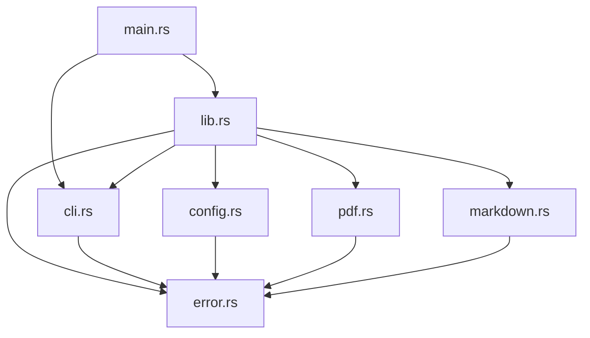

# Architecture Overview

## System Architecture

pdf2md follows a **modular, layered architecture** that separates concerns into distinct components. This design promotes maintainability, testability, and extensibility.

## Architectural Layers

### 1. CLI Layer
**File**: `src/main.rs`, `src/cli.rs`

**Responsibilities**:
- Command-line argument parsing using clap
- Help and version information display
- Error formatting for user-friendly output
- Application entry point

**Key Design Decisions**:
- Uses clap's derive macros for declarative argument parsing
- Minimal logic - delegates to application layer
- Handles process exit codes based on error types

### 2. Application Layer
**File**: `src/lib.rs`, `src/config.rs`

**Responsibilities**:
- Input validation and configuration management
- Orchestration of PDF and Markdown processing
- Logging initialization and coordination
- High-level error handling

**Key Design Decisions**:
- Single `run()` function as the main entry point
- Configuration struct separates CLI concerns from business logic
- Centralized logging setup based on verbosity settings

### 3. Processing Modules

#### PDF Processing Module
**File**: `src/pdf.rs`

**Responsibilities**:
- PDF file validation
- PDF document opening and reading
- Text content extraction
- Metadata extraction for dry-run mode

**Key Design Decisions**:
- Encapsulates PDF library interactions
- Provides clean API: `open()`, `extract_text()`, `extract_metadata()`
- Validates PDF format before processing

#### Markdown Generation Module
**File**: `src/markdown.rs`

**Responsibilities**:
- Content formatting as Markdown
- Output file writing
- Directory creation for output paths

**Key Design Decisions**:
- Separates formatting logic from I/O operations
- Handles parent directory creation automatically
- Simple, focused functions for single responsibilities

### 4. Cross-Cutting Concerns

#### Error Handling
**File**: `src/error.rs`

**Responsibilities**:
- Custom error type definitions
- Error conversion from external libraries
- User-friendly error messages
- Exit code mapping

**Key Design Decisions**:
- Single `Pdf2MdError` enum for all error types
- Implements `std::error::Error` and `Display` traits
- Provides context-rich error messages

See **[[Error-Handling-Component]]** for detailed information.

#### Configuration Management
**File**: `src/config.rs`

**Responsibilities**:
- Configuration struct definition
- Validation of input/output paths
- Conversion from CLI arguments to configuration

See **[[Configuration-Component]]** for detailed information.

## Design Principles

### 1. Separation of Concerns
Each module has a single, well-defined responsibility. This makes the codebase easier to understand, test, and maintain.

### 2. Dependency Inversion
Higher-level modules (application layer) depend on abstractions, not concrete implementations. This allows for easier testing and future extensibility.

### 3. Error Handling as a First-Class Concern
All fallible operations return `Result<T, Pdf2MdError>`. Errors are propagated using the `?` operator and handled at the appropriate level.

### 4. Testability
All modules are designed for testability:
- Pure functions where possible
- Clear interfaces for mocking
- Comprehensive unit and integration tests

### 5. Performance Considerations
- Minimal allocations
- Efficient PDF parsing
- Streaming where appropriate for large files

### 6. Security
- Input validation at all entry points
- Path traversal prevention
- Safe error messages (no information leakage)

## Module Dependencies



### Dependency Rules

1. **CLI Layer** depends on Application Layer
2. **Application Layer** orchestrates Processing Modules
3. **Processing Modules** are independent of each other
4. **All modules** depend on Error module
5. **No circular dependencies**

## Component Interaction

For detailed diagrams of how components interact, see:
- **[[Architecture-Diagrams]]** - Visual block diagrams
- **[[Data-Flow-Sequences]]** - Sequence diagrams showing message flow

## Module Details

For detailed information about each component:
- **[[CLI-Component]]** - CLI parsing and user interaction
- **[[PDF-Processing-Component]]** - PDF reading and extraction
- **[[Markdown-Generation-Component]]** - Markdown formatting
- **[[Configuration-Component]]** - Configuration management
- **[[Error-Handling-Component]]** - Error types and handling

## Extension Points

The architecture is designed for future extensibility:

### 1. Custom PDF Processors
Define a trait for PDF processing to allow alternative implementations:
```rust
pub trait PdfProcessor {
    fn extract_text(&self, path: &Path) -> Result<ExtractedContent>;
}
```

### 2. Custom Markdown Formatters
Define a trait for Markdown formatting to support different styles:
```rust
pub trait MarkdownFormatter {
    fn format(&self, content: &ExtractedContent) -> String;
}
```

### 3. Output Format Abstraction
Support multiple output formats beyond Markdown:
```rust
pub trait OutputFormatter {
    fn format(&self, content: &ExtractedContent) -> String;
    fn file_extension(&self) -> &str;
}
```

### 4. Configuration File Support
Future versions could support `.pdf2mdrc` configuration files:
- Default settings
- Output format preferences
- Custom formatting rules

## Performance Characteristics

### Time Complexity
- **CLI Parsing**: O(1) - constant time for argument parsing
- **PDF Opening**: O(n) - linear with file size
- **Text Extraction**: O(p) - linear with number of pages
- **Markdown Generation**: O(c) - linear with content size
- **File Writing**: O(c) - linear with content size

### Space Complexity
- **PDF Content**: O(c) - stores extracted content in memory
- **Markdown Output**: O(c) - generates Markdown string in memory
- **Overall**: O(c) - dominated by content size

### Optimization Opportunities
1. Stream large PDFs instead of loading entirely into memory
2. Process pages incrementally
3. Use memory-mapped I/O for very large files

## Security Considerations

### Input Validation
- All file paths are validated before use
- PDF format is verified before processing
- File sizes could be checked to prevent DoS

### Path Traversal Prevention
- Output paths are validated
- Parent directory checks prevent escaping project boundaries

### Error Messages
- Don't expose internal system details
- Sanitize file paths in error messages
- Avoid leaking sensitive information

### Future Security Enhancements
- Sandboxing PDF processing
- Resource limits (memory, CPU time)
- Malicious PDF detection

## Testing Architecture

For detailed testing strategy, see **[[Testing-Strategy]]**.

### Testing Layers

1. **Unit Tests** - Test individual functions and modules
2. **Integration Tests** - Test complete workflows
3. **End-to-End Tests** - Test CLI with real PDFs

### Test Coverage Goals

- **Minimum**: 80% code coverage
- **Critical Paths**: 100% coverage
- **Error Handling**: All error cases tested

## References

- [Full Architecture Document](../../blob/main/docs/architecture.md)
- [Detailed Design Document](../../blob/main/docs/design.md)
- **[[Architecture-Diagrams]]** - Visual diagrams
