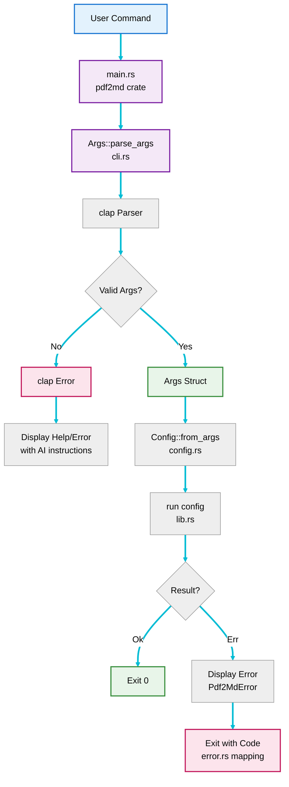
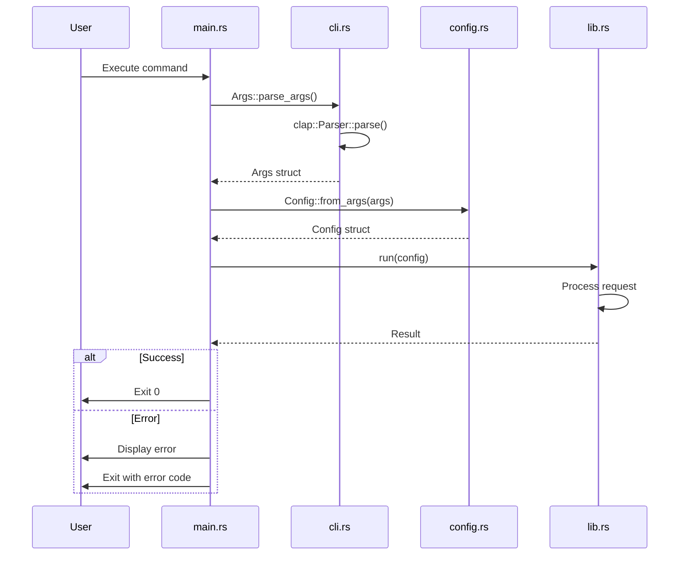

# CLI Component

The CLI (Command-Line Interface) component handles all user interaction through the command line. It provides argument parsing, help display, version metadata, and user-facing error messages.

## Location

**`crates/pdf2md/`** - CLI binary crate

## Files

- **`src/main.rs`** - Application entry point and process management
- **`src/cli.rs`** - Argument parsing and CLI structure
- **`build.rs`** - Build-time metadata capture (host, commit, timestamp)

## Responsibilities

1. **Argument Parsing** - Parse and validate command-line arguments
2. **Help Display** - Show usage information and examples
3. **Version Display** - Show version information
4. **Error Formatting** - Convert errors to user-friendly messages
5. **Exit Code Management** - Map errors to appropriate exit codes

## Architecture



## CLI Structure

### Args Struct

Defined in `src/cli.rs`:

```rust
#[derive(Parser, Debug)]
#[command(name = "pdf2md")]
#[command(version)]
#[command(about = "Convert PDF documents to Markdown format")]
pub struct Args {
    /// Path to input PDF file
    #[arg(short, long, value_name = "FILE")]
    pub input: PathBuf,

    /// Path to output Markdown file
    #[arg(short, long, value_name = "FILE")]
    pub output: PathBuf,

    /// Enable verbose output
    #[arg(short, long, default_value_t = false)]
    pub verbose: bool,

    /// Preview mode: show PDF structure without converting
    #[arg(short = 'n', long, default_value_t = false)]
    pub dry_run: bool,
}
```

### Field Descriptions

| Field | Type | Flag | Description |
|-------|------|------|-------------|
| `input` | `PathBuf` | `-i, --input` | Path to the input PDF file |
| `output` | `PathBuf` | `-o, --output` | Path to the output Markdown file |
| `verbose` | `bool` | `-v, --verbose` | Enable detailed logging |
| `dry_run` | `bool` | `-n, --dry-run` | Preview mode without conversion |

## Usage Examples

### Basic Conversion

```bash
pdf2md -i document.pdf -o document.md
```

### Verbose Mode

```bash
pdf2md -i document.pdf -o document.md --verbose
```

**Output**:
```
Starting pdf2md
Input: document.pdf
Opening PDF file: document.pdf
Extracting text from PDF
Extracted 42 pages
Writing Markdown to: document.md
Successfully wrote 15234 bytes
Conversion complete
```

### Dry-Run Preview

```bash
pdf2md -i document.pdf -o document.md --dry-run
```

**Output**:
```
=== PDF Preview ===
Pages: 42
Title: User Manual
Author: John Doe
Has extractable text: Yes

Detected sections:
  * Introduction
  * Getting Started
  * Advanced Features
  * Troubleshooting

=== End Preview ===
```

### Help Display

```bash
pdf2md --help
```

### Version Display

```bash
pdf2md --version
```

## Main Entry Point

The `main.rs` file provides the application entry point:

```rust
fn main() {
    // Parse command-line arguments
    let args = Args::parse_args();

    // Create configuration
    let config = Config::from_args(args);

    // Run application
    if let Err(e) = run(config) {
        eprintln!("Error: {}", e);
        let exit_code = error_to_exit_code(&e);
        process::exit(exit_code);
    }
}
```

### Key Responsibilities

1. **Parse Arguments** - Delegate to `Args::parse_args()`
2. **Create Config** - Convert `Args` to `Config`
3. **Execute** - Call `run(config)`
4. **Handle Errors** - Display errors and exit with appropriate code

## Exit Codes

The CLI uses standard exit codes to indicate different error conditions:

| Code | Meaning | Error Type |
|------|---------|------------|
| 0 | Success | N/A |
| 1 | Invalid arguments or input | `InvalidInput` |
| 2 | I/O error | `IoError` |
| 3 | Markdown generation error | `MarkdownGeneration` |
| 4 | PDF processing error | `PdfProcessing` |

Implemented in `src/error.rs`:

```rust
pub fn error_to_exit_code(error: &Pdf2MdError) -> i32 {
    match error {
        Pdf2MdError::InvalidInput(_) => 1,
        Pdf2MdError::IoError(_) => 2,
        Pdf2MdError::MarkdownGeneration(_) => 3,
        Pdf2MdError::PdfProcessing(_) => 4,
    }
}
```

## Error Display

Errors are displayed in a user-friendly format:

```rust
if let Err(e) = run(config) {
    eprintln!("Error: {}", e);
    process::exit(error_to_exit_code(&e));
}
```

### Example Error Messages

**File not found**:
```
Error: Invalid input: Input file does not exist: missing.pdf
```

**Invalid PDF**:
```
Error: PDF processing error: File is not a valid PDF (missing PDF header)
```

**Directory doesn't exist**:
```
Error: Invalid input: Output directory does not exist: /nonexistent/path
```

## Argument Validation

Clap provides automatic validation for:
- Required arguments
- Argument types (PathBuf, bool, etc.)
- Mutually exclusive options (if configured)

Additional validation happens in the **[[Configuration-Component]]**:
- Input file existence
- Input file is a file (not directory)
- Output directory existence
- PDF format validation

## Integration with Application Layer



## Testing

### Unit Tests

Tests in `src/cli.rs`:
- Argument parsing with valid inputs
- Default values for optional arguments
- Help and version flags

### Integration Tests

Tests in `tests/integration_test.rs`:

```rust
#[test]
fn test_help_flag() {
    let mut cmd = Command::cargo_bin("pdf2md").unwrap();
    cmd.arg("--help")
        .assert()
        .success()
        .stdout(predicate::str::contains("Convert PDF documents"));
}

#[test]
fn test_missing_required_args() {
    let mut cmd = Command::cargo_bin("pdf2md").unwrap();
    cmd.assert().failure();
}

#[test]
fn test_version_flag() {
    let mut cmd = Command::cargo_bin("pdf2md").unwrap();
    cmd.arg("--version")
        .assert()
        .success();
}
```

## Dependencies

### External Crates

- **`clap`** (v4.x) - Command-line argument parser
  - Feature: `derive` - Derive macros for declarative parsing

### Internal Dependencies

- **`config`** module - Configuration struct and validation
- **`error`** module - Error types and exit code mapping
- **`lib`** module - Main application logic

## Design Decisions

### Why clap?

**Advantages**:
- Declarative API with derive macros
- Automatic help generation
- Type-safe argument parsing
- Comprehensive validation
- Wide adoption and excellent documentation

### Why minimal logic in main?

**Separation of Concerns**:
- `main.rs` handles only process-level concerns (exit codes, stdio)
- Business logic lives in `lib.rs` for better testability
- Easier to test library functions without invoking the full CLI

### Why PathBuf instead of String?

**Type Safety**:
- `PathBuf` is the correct type for file paths
- Handles OS-specific path separators
- Integrates with `std::fs` and `std::path` APIs
- Prevents string manipulation errors

## Future Enhancements

### Configuration File Support

Support `.pdf2mdrc` for default settings:

```rust
#[derive(Parser, Debug)]
pub struct Args {
    /// Path to configuration file
    #[arg(short, long)]
    pub config: Option<PathBuf>,

    // ... existing fields
}
```

### Batch Processing

Support multiple input files:

```rust
#[derive(Parser, Debug)]
pub struct Args {
    /// Paths to input PDF files
    #[arg(short, long, value_name = "FILES")]
    pub input: Vec<PathBuf>,

    /// Output directory
    #[arg(short, long, value_name = "DIR")]
    pub output_dir: PathBuf,
}
```

### Progress Bars

For large files, show progress:

```rust
#[derive(Parser, Debug)]
pub struct Args {
    /// Show progress bar
    #[arg(short, long)]
    pub progress: bool,
}
```

## Related Pages

- **[[Configuration-Component]]** - Configuration management
- **[[Error-Handling-Component]]** - Error types and handling
- **[[Architecture-Overview]]** - Overall system architecture
- **[[Data-Flow-Sequences]]** - CLI interaction sequences
- **[[Testing-Strategy]]** - Testing approach

## Reference Documentation

- [clap Documentation](https://docs.rs/clap/)
- [Detailed Design Document](../../blob/main/docs/design.md)
- [Architecture Document](../../blob/main/docs/architecture.md)
