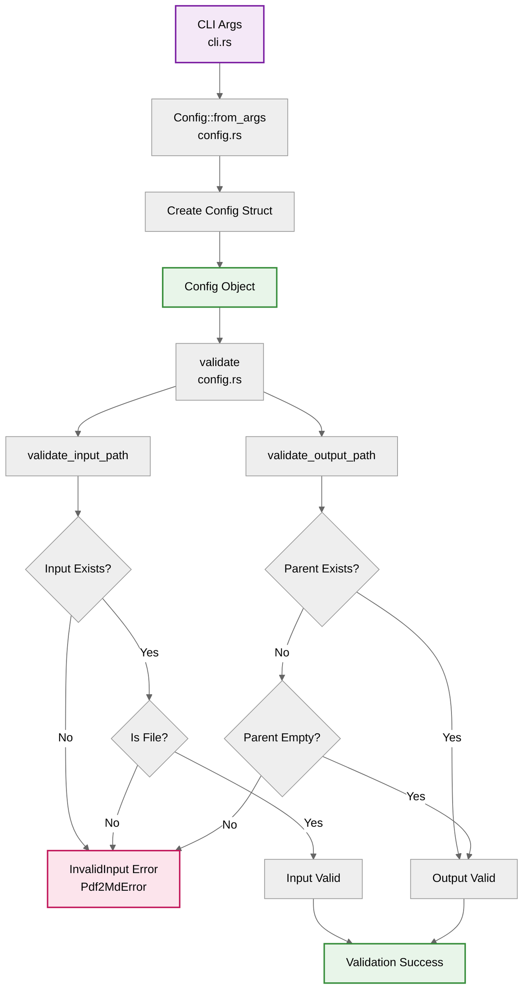
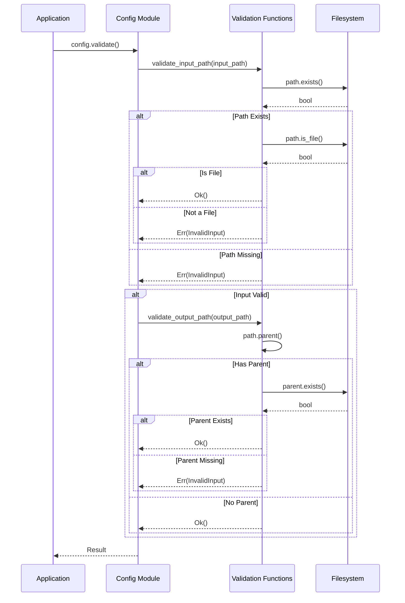

# Configuration Component

The Configuration component manages application settings, validates input/output paths, and converts CLI arguments into a structured configuration object.

## Location

**`crates/pdf2md/src/config.rs`** - Configuration management module (pdf2md binary crate)

## Responsibilities

1. **Configuration Structure** - Define configuration data structure
2. **Argument Conversion** - Convert CLI args to Config
3. **Path Validation** - Validate input and output paths
4. **Settings Management** - Manage application settings

## Architecture



## Data Structures

### Config Struct

The main configuration structure:

```rust
#[derive(Debug, Clone)]
pub struct Config {
    pub input_path: PathBuf,
    pub output_path: PathBuf,
    pub verbose: bool,
    pub dry_run: bool,
}
```

**Fields**:
- `input_path` - Path to the input PDF file
- `output_path` - Path to the output Markdown file
- `verbose` - Enable verbose logging
- `dry_run` - Preview mode without conversion

## Core Functions

### from_args

Creates a Config from CLI arguments:

```rust
impl Config {
    pub fn from_args(args: Args) -> Self {
        Self {
            input_path: args.input,
            output_path: args.output,
            verbose: args.verbose,
            dry_run: args.dry_run,
        }
    }
}
```

**Process**:
1. Extract fields from Args
2. Convert to Config fields
3. No validation at this stage (validation is separate)

**Why Separate from Args?**
- **Separation of Concerns**: CLI parsing vs. configuration
- **Testability**: Can create Config without CLI
- **Future Extensibility**: Config could come from files, environment, etc.

### validate

Validates the configuration:

```rust
impl Config {
    pub fn validate(&self) -> Result<()> {
        validate_input_path(&self.input_path)?;
        validate_output_path(&self.output_path)?;
        Ok(())
    }
}
```

**Process**:
1. Validate input path
2. Validate output path
3. Return first error encountered, or Ok(())

**Called From**: Application layer (`lib.rs`) before processing

### validate_input_path

Validates the input file path:

```rust
fn validate_input_path(path: &Path) -> Result<()> {
    if !path.exists() {
        return Err(Pdf2MdError::InvalidInput(
            format!("Input file does not exist: {}", path.display())
        ));
    }

    if !path.is_file() {
        return Err(Pdf2MdError::InvalidInput(
            format!("Input path is not a file: {}", path.display())
        ));
    }

    Ok(())
}
```

**Checks**:
1. **File Exists** - Path must exist on filesystem
2. **Is File** - Path must be a file, not a directory

**Error Messages**:
- `"Input file does not exist: /path/to/file.pdf"`
- `"Input path is not a file: /path/to/directory"`

### validate_output_path

Validates the output file path:

```rust
fn validate_output_path(path: &Path) -> Result<()> {
    if let Some(parent) = path.parent() {
        if !parent.as_os_str().is_empty() && !parent.exists() {
            return Err(Pdf2MdError::InvalidInput(
                format!("Output directory does not exist: {}", parent.display())
            ));
        }
    }
    Ok(())
}
```

**Checks**:
1. **Get Parent Directory** - Extract parent from path
2. **Parent Exists** - If parent specified, it must exist
3. **Empty Parent OK** - If no parent (current dir), always valid

**Logic**:
- `output.md` -> OK (current directory)
- `docs/output.md` -> Check if `docs/` exists
- `docs/guide/output.md` -> Check if `docs/guide/` exists

**Why Not Create Directories?**
- Validation should not modify filesystem
- Directory creation happens in Markdown module during write
- Separation of validation from side effects

## Validation Flow



## Usage Examples

### Basic Usage

```rust
let args = Args::parse_args();
let config = Config::from_args(args);

if let Err(e) = config.validate() {
    eprintln!("Configuration error: {}", e);
    return;
}

// Proceed with valid config
run(config)?;
```

### Manual Configuration

For testing or programmatic use:

```rust
let config = Config {
    input_path: PathBuf::from("input.pdf"),
    output_path: PathBuf::from("output.md"),
    verbose: true,
    dry_run: false,
};

config.validate()?;
```

## Error Cases

### Input File Not Found

```rust
let config = Config {
    input_path: PathBuf::from("nonexistent.pdf"),
    output_path: PathBuf::from("output.md"),
    verbose: false,
    dry_run: false,
};

assert!(config.validate().is_err());
// Error: Input file does not exist: nonexistent.pdf
```

### Input Is Directory

```rust
let config = Config {
    input_path: PathBuf::from("src/"),  // Directory
    output_path: PathBuf::from("output.md"),
    verbose: false,
    dry_run: false,
};

assert!(config.validate().is_err());
// Error: Input path is not a file: src/
```

### Output Directory Missing

```rust
let config = Config {
    input_path: PathBuf::from("input.pdf"),
    output_path: PathBuf::from("nonexistent/output.md"),
    verbose: false,
    dry_run: false,
};

assert!(config.validate().is_err());
// Error: Output directory does not exist: nonexistent
```

## Testing

### Unit Tests

Located in `src/config.rs`:

```rust
#[cfg(test)]
mod tests {
    use super::*;
    use tempfile::TempDir;
    use std::fs::File;

    #[test]
    fn test_config_from_args() {
        let args = Args {
            input: PathBuf::from("input.pdf"),
            output: PathBuf::from("output.md"),
            verbose: true,
            dry_run: false,
        };

        let config = Config::from_args(args);
        assert_eq!(config.verbose, true);
        assert_eq!(config.dry_run, false);
    }

    #[test]
    fn test_validate_valid_config() {
        let temp_dir = TempDir::new().unwrap();
        let input = temp_dir.path().join("input.pdf");
        File::create(&input).unwrap();

        let config = Config {
            input_path: input,
            output_path: temp_dir.path().join("output.md"),
            verbose: false,
            dry_run: false,
        };

        assert!(config.validate().is_ok());
    }

    #[test]
    fn test_validate_missing_input() {
        let config = Config {
            input_path: PathBuf::from("missing.pdf"),
            output_path: PathBuf::from("output.md"),
            verbose: false,
            dry_run: false,
        };

        assert!(config.validate().is_err());
    }

    #[test]
    fn test_validate_input_is_directory() {
        let temp_dir = TempDir::new().unwrap();

        let config = Config {
            input_path: temp_dir.path().to_path_buf(),
            output_path: PathBuf::from("output.md"),
            verbose: false,
            dry_run: false,
        };

        let result = config.validate();
        assert!(result.is_err());
        assert!(result.unwrap_err().to_string().contains("not a file"));
    }

    #[test]
    fn test_validate_missing_output_directory() {
        let temp_dir = TempDir::new().unwrap();
        let input = temp_dir.path().join("input.pdf");
        File::create(&input).unwrap();

        let config = Config {
            input_path: input,
            output_path: PathBuf::from("nonexistent/output.md"),
            verbose: false,
            dry_run: false,
        };

        let result = config.validate();
        assert!(result.is_err());
        assert!(result.unwrap_err().to_string().contains("directory does not exist"));
    }
}
```

## Design Decisions

### Why PathBuf Instead of String?

**Type Safety**:
- `PathBuf` is the correct type for file paths
- Handles OS-specific path separators automatically
- Provides methods like `.exists()`, `.is_file()`, `.parent()`
- Prevents string manipulation bugs

### Why Separate Validation?

**Flexibility**:
- Can create Config without validating (for testing)
- Validation can be called multiple times
- Clear separation between creation and validation

**Error Handling**:
- Validation errors are explicit
- Can provide detailed error messages
- Caller decides when validation happens

### Why Not Validate in from_args?

**Single Responsibility**:
- `from_args` does conversion only
- `validate` does validation only
- Each function has one clear purpose

**Testability**:
- Can test conversion independently
- Can test validation independently
- Easier to write focused tests

## Future Enhancements

### Configuration File Support

Load defaults from `.pdf2mdrc`:

```rust
impl Config {
    pub fn from_file(path: &Path) -> Result<Self> {
        // Read TOML/JSON config file
        // Parse into Config struct
        // Merge with CLI args
    }

    pub fn merge_with_args(self, args: Args) -> Self {
        // Override config file settings with CLI args
    }
}
```

### Environment Variables

Support environment variable overrides:

```rust
impl Config {
    pub fn from_env() -> Self {
        Config {
            input_path: env::var("PDF2MD_INPUT").map(PathBuf::from)
                .unwrap_or_default(),
            output_path: env::var("PDF2MD_OUTPUT").map(PathBuf::from)
                .unwrap_or_default(),
            verbose: env::var("PDF2MD_VERBOSE").is_ok(),
            dry_run: false,
        }
    }
}
```

### Advanced Validation

More sophisticated validation:

```rust
impl Config {
    pub fn validate_advanced(&self) -> Result<()> {
        // Check file size limits
        let metadata = fs::metadata(&self.input_path)?;
        if metadata.len() > MAX_FILE_SIZE {
            return Err(Pdf2MdError::InvalidInput(
                "File exceeds maximum size".to_string()
            ));
        }

        // Check write permissions
        if !self.output_path.parent().unwrap().permissions().readonly() {
            return Err(Pdf2MdError::InvalidInput(
                "No write permission for output directory".to_string()
            ));
        }

        Ok(())
    }
}
```

### Builder Pattern

Fluent API for configuration:

```rust
impl Config {
    pub fn builder() -> ConfigBuilder {
        ConfigBuilder::default()
    }
}

pub struct ConfigBuilder {
    input_path: Option<PathBuf>,
    output_path: Option<PathBuf>,
    verbose: bool,
    dry_run: bool,
}

impl ConfigBuilder {
    pub fn input(mut self, path: PathBuf) -> Self {
        self.input_path = Some(path);
        self
    }

    pub fn output(mut self, path: PathBuf) -> Self {
        self.output_path = Some(path);
        self
    }

    pub fn verbose(mut self, verbose: bool) -> Self {
        self.verbose = verbose;
        self
    }

    pub fn build(self) -> Result<Config> {
        // Validate required fields
        // Create Config
    }
}

// Usage:
let config = Config::builder()
    .input(PathBuf::from("input.pdf"))
    .output(PathBuf::from("output.md"))
    .verbose(true)
    .build()?;
```

## Dependencies

### External Crates

- **Standard Library Only**
  - `std::path` - Path and PathBuf types
  - `std::fs` - Filesystem operations for validation

### Internal Dependencies

- **`cli`** module - `Args` type
- **`error`** module - `Pdf2MdError`, `Result` types

## Related Pages

- **[[CLI-Component]]** - Provides Args input
- **[[Error-Handling-Component]]** - Error types and handling
- **[[Architecture-Overview]]** - Configuration in overall architecture
- **[[Data-Flow-Sequences]]** - Configuration validation flow
- **[[Testing-Strategy]]** - Testing configuration

## Reference Documentation

- [Design Document](../../blob/main/docs/design.md)
- [Architecture Document](../../blob/main/docs/architecture.md)
- [std::path Documentation](https://doc.rust-lang.org/std/path/)
