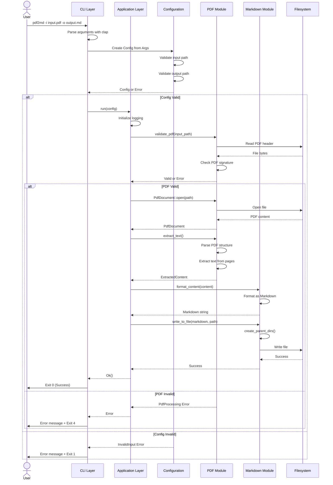
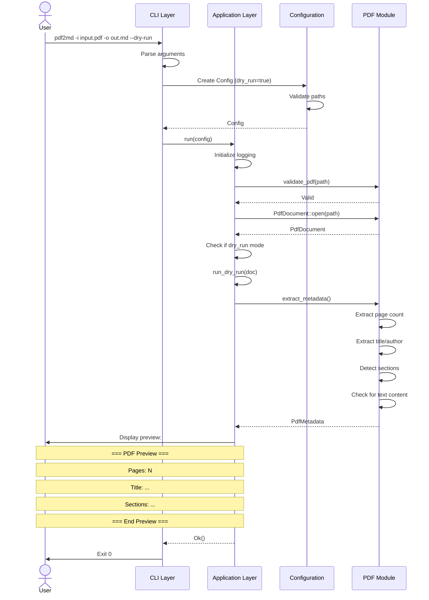
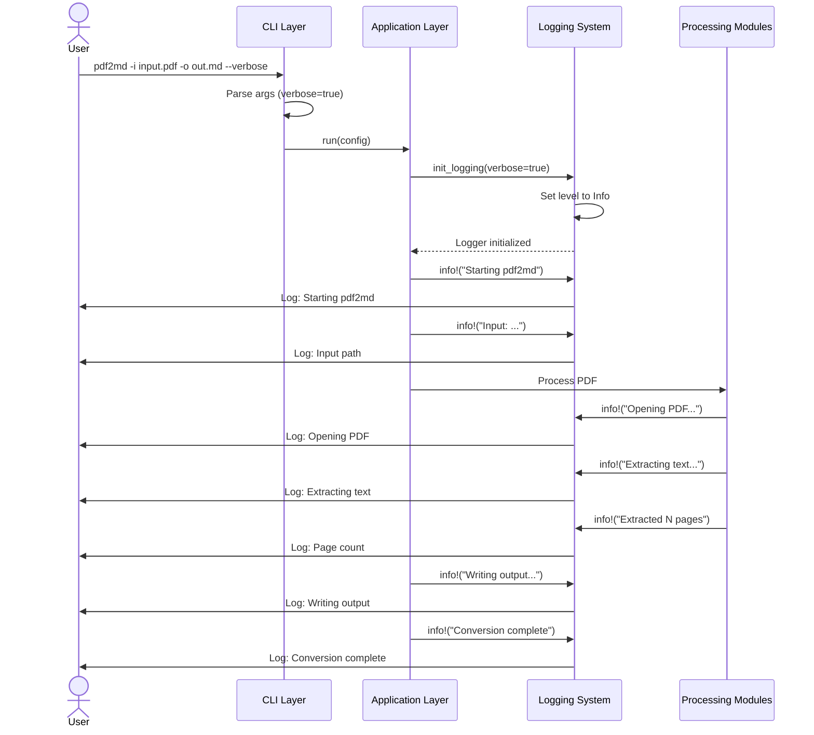
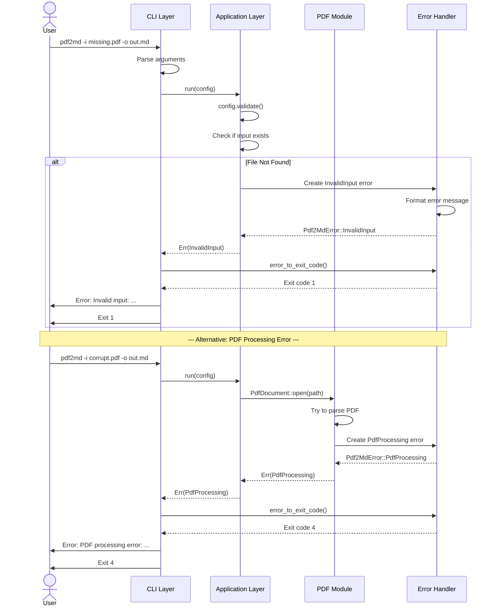
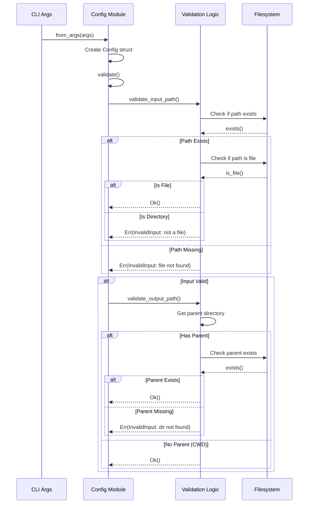
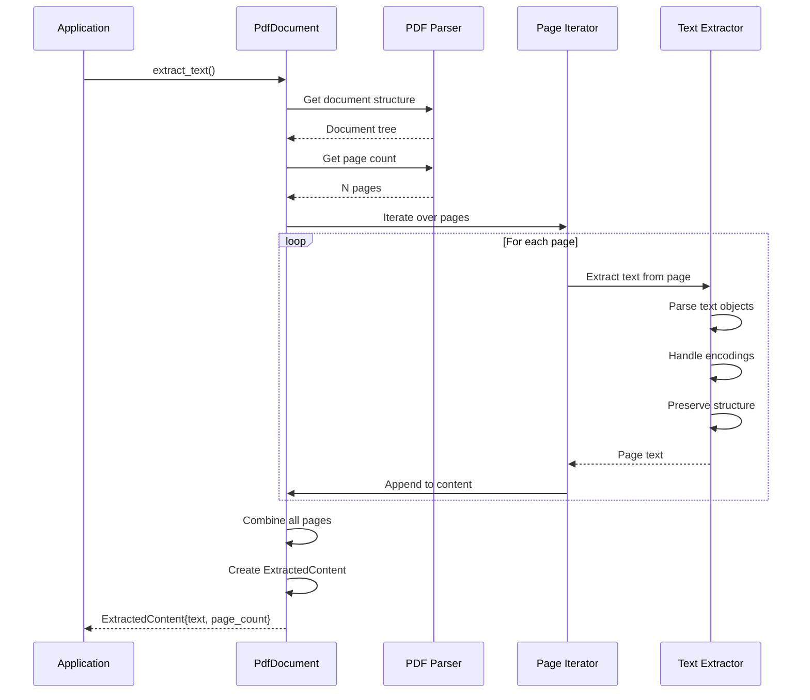
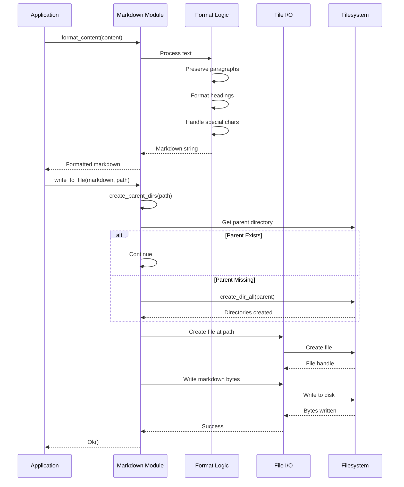

# Data Flow and Sequence Diagrams

This page illustrates the data flow and interaction sequences between components for different workflows in pdf2md.

## Standard Conversion Workflow

The complete sequence for a standard PDF to Markdown conversion:

## Dry-Run Preview Workflow

Sequence for dry-run mode (preview without conversion):

## Verbose Mode Logging Flow

How verbose mode affects logging throughout the workflow:

## Error Handling Flow

Sequence showing error propagation and handling:

## Configuration Validation Flow

Detailed view of configuration validation:

## PDF Text Extraction Flow

Detailed sequence of PDF text extraction:

## Markdown Generation and Writing Flow

Sequence for Markdown formatting and file output:

## Complete Data Flow Pipeline

End-to-end data transformation flow:

```mermaid
flowchart LR
    A[Command Line Args] --> B[Parsed Args Struct]
    B --> C[Config Struct]
    C --> D{Validation}
    D -->|Valid| E[Validated Config]
    D -->|Invalid| F[Error Exit]

    E --> G[PDF Path]
    G --> H[Open PDF File]
    H --> I[PdfDocument Object]

    I --> J{Dry Run?}
    J -->|Yes| K[Extract Metadata]
    J -->|No| L[Extract Text]

    K --> M[PdfMetadata Struct]
    M --> N[Format Preview]
    N --> O[Console Output]

    L --> P[ExtractedContent Struct]
    P --> Q[Format as Markdown]
    Q --> R[Markdown String]
    R --> S[Write to File]
    S --> T[Success Exit]

    style A fill:#e3f2fd
    style B fill:#e1f5ff
    style C fill:#b3e5fc
    style E fill:#c8e6c9
    style F fill:#ffcdd2
    style I fill:#f3e5f5
    style P fill:#fff9c4
    style R fill:#ffe0b2
    style T fill:#c8e6c9

    linkStyle default stroke:#00bcd4,stroke-width:3px
```

## Related Pages

- **[[Architecture-Overview]]** - Overall architecture description
- **[[Architecture-Diagrams]]** - Block diagrams and component views
- **[[CLI-Component]]** - CLI implementation details
- **[[PDF-Processing-Component]]** - PDF processing implementation
- **[[Markdown-Generation-Component]]** - Markdown generation implementation
- **[[Error-Handling-Component]]** - Error handling patterns
- **[[Testing-Strategy]]** - How these flows are tested
