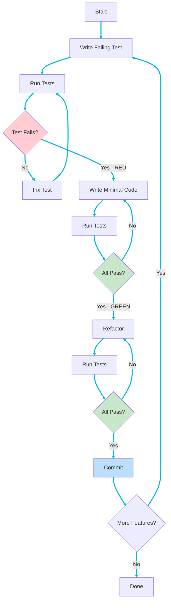
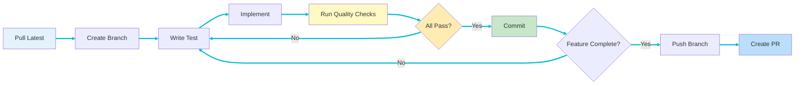

# Development Process

This page describes the development process, workflows, and quality standards for pdf2md development.

## Overview

pdf2md follows strict **Test-Driven Development (TDD)** practices with a focus on quality, maintainability, and continuous improvement.

## Development Principles

1. **Test First** - Write tests before implementation
2. **Incremental Development** - Small, focused changes
3. **Quality Over Speed** - No compromises on quality
4. **Zero Warnings** - All warnings must be fixed
5. **Continuous Refactoring** - Improve code continuously
6. **Documentation** - Document all public APIs

## TDD Workflow

### Red-Green-Refactor Cycle



### Detailed Steps

#### 1. RED - Write Failing Test

Write a test for the next small piece of functionality:

```rust
#[test]
fn test_validate_pdf_header() {
    let path = Path::new("tests/fixtures/sample.pdf");
    let result = validate_pdf(path);
    assert!(result.is_ok());
}
```

Run test: Should fail (function doesn't exist yet)

```bash
cargo test test_validate_pdf_header
```

Expected: [x] Test fails

#### 2. GREEN - Write Minimal Code

Write just enough code to make the test pass:

```rust
pub fn validate_pdf(path: &Path) -> Result<()> {
    let mut file = File::open(path)?;
    let mut header = [0u8; 5];
    file.read_exact(&mut header)?;

    if &header != b"%PDF-" {
        return Err(Pdf2MdError::PdfProcessing(
            "File is not a valid PDF".to_string()
        ));
    }

    Ok(())
}
```

Run test: Should pass

```bash
cargo test test_validate_pdf_header
```

Expected: [x] Test passes

#### 3. REFACTOR - Improve Code

Improve code while keeping tests green:

```rust
pub fn validate_pdf(path: &Path) -> Result<()> {
    let mut file = File::open(path)
        .map_err(|e| Pdf2MdError::IoError(e))?;

    let mut header = [0u8; PDF_HEADER_SIZE];
    file.read_exact(&mut header)
        .map_err(|e| Pdf2MdError::IoError(e))?;

    if &header != PDF_SIGNATURE {
        return Err(Pdf2MdError::PdfProcessing(
            "File is not a valid PDF (missing PDF header)".to_string()
        ));
    }

    Ok(())
}

const PDF_SIGNATURE: &[u8; 5] = b"%PDF-";
const PDF_HEADER_SIZE: usize = 5;
```

Run all tests:

```bash
cargo test
```

Expected: [x] All tests pass

## Development Workflow

### Daily Workflow



### 1. Start Development

```bash
# Pull latest changes
git pull origin main

# Create feature branch
git checkout -b feature/add-table-support

# Verify clean state
cargo test
cargo clippy
cargo fmt -- --check
```

### 2. Implement Feature (TDD)

For each small piece of functionality:

```bash
# 1. Write test
# Edit test file

# 2. Verify test fails
cargo test new_test_name

# 3. Implement code
# Edit source file

# 4. Verify test passes
cargo test new_test_name

# 5. Run all tests
cargo test

# 6. Refactor if needed
# Improve code

# 7. Verify still passes
cargo test
```

### 3. Quality Checks

Before committing, run all checks:

```bash
# Format code
cargo fmt

# Lint (no warnings allowed)
cargo clippy -- -D warnings

# Build without warnings
cargo build --release 2>&1 | grep warning && echo "Warnings found!" || echo "Clean build!"

# Run all tests
cargo test

# Check documentation
cargo doc --no-deps
```

All must pass before proceeding.

### 4. Commit Changes

```bash
# Stage changes
git add .

# Commit with descriptive message
git commit -m "feat: add PDF table detection

- Implement table structure detection
- Add tests for table parsing
- Update documentation
"

# Push to remote
git push -u origin feature/add-table-support
```

### 5. Create Pull Request

- Open PR on GitHub
- Ensure CI passes
- Request review
- Address feedback
- Merge when approved

## Quality Standards

### Code Quality

#### Formatting

Use `rustfmt` with default settings:

```bash
cargo fmt
```

**Standard**:
- 4-space indentation
- 100-character line limit
- Standard Rust formatting conventions

#### Linting

Use `clippy` with strict settings:

```bash
cargo clippy -- -D warnings
```

**Requirements**:
- No clippy warnings allowed
- Fix all suggestions
- Document intentional exceptions with `#[allow(clippy::...)]`

#### Warnings

Zero tolerance for warnings:

```bash
cargo build --release
```

**Standard**:
- No compiler warnings
- No unused imports
- No dead code
- No deprecated API usage

### Documentation Standards

#### Public API Documentation

All public items must be documented:

```rust
/// Validates that a file is a valid PDF by checking the header.
///
/// # Arguments
///
/// * `path` - Path to the PDF file to validate
///
/// # Returns
///
/// Returns `Ok(())` if the file is a valid PDF, or an error if:
/// - File cannot be opened
/// - File doesn't have PDF signature
///
/// # Examples
///
/// ```no_run
/// use std::path::Path;
/// use pdf2md::pdf::validate_pdf;
///
/// let path = Path::new("document.pdf");
/// validate_pdf(path).expect("Valid PDF");
/// ```
///
/// # Errors
///
/// Returns `Pdf2MdError::IoError` if the file cannot be read.
/// Returns `Pdf2MdError::PdfProcessing` if the file is not a valid PDF.
pub fn validate_pdf(path: &Path) -> Result<()> {
    // Implementation
}
```

#### Module Documentation

```rust
//! PDF processing module.
//!
//! This module provides functionality for reading PDF files and extracting
//! text content. It includes validation, parsing, and content extraction.
//!
//! # Examples
//!
//! ```no_run
//! use pdf2md::pdf::PdfDocument;
//! use std::path::Path;
//!
//! let doc = PdfDocument::open(Path::new("document.pdf"))?;
//! let content = doc.extract_text()?;
//! println!("Extracted {} pages", content.page_count);
//! ```
```

### Testing Standards

See **[[Testing-Strategy]]** for detailed testing requirements.

**Summary**:
- Minimum 80% code coverage
- All public functions tested
- All error cases covered
- Integration tests for workflows
- Tests run fast (< 30 seconds total)

### Function Size Limits

**Guidelines**:
- Functions < 50 lines preferred
- Functions < 100 lines acceptable
- Functions > 100 lines require justification

**Refactoring triggers**:
- Function does multiple things
- Deep nesting (> 3 levels)
- Duplicate code
- Hard to test
- Hard to understand

### Complexity Limits

Use `cargo-complexity` to check:

```bash
cargo install cargo-complexity
cargo complexity
```

**Standards**:
- Cyclomatic complexity < 10 preferred
- Complexity < 15 acceptable
- Complexity > 15 requires refactoring

## Git Workflow

### Branch Naming

```
feature/description       # New features
fix/description          # Bug fixes
refactor/description     # Code refactoring
docs/description         # Documentation
test/description         # Test improvements
```

**Examples**:
- `feature/add-ocr-support`
- `fix/pdf-header-validation`
- `refactor/extract-pdf-parser`
- `docs/update-api-docs`

### Commit Messages

Use conventional commits format:

```
<type>(<scope>): <subject>

<body>

<footer>
```

**Types**:
- `feat` - New feature
- `fix` - Bug fix
- `refactor` - Code refactoring
- `test` - Test changes
- `docs` - Documentation
- `chore` - Maintenance

**Examples**:

```
feat(pdf): add table structure detection

- Implement table boundary detection
- Add cell content extraction
- Include tests for various table formats

Closes #42
```

```
fix(config): validate parent directory exists

Previously allowed output paths with non-existent parent directories.
Now validates parent exists before proceeding.

Fixes #37
```

### Pull Request Process

1. **Create PR**
   - Descriptive title
   - Link to issue
   - Description of changes
   - Testing performed

2. **CI Must Pass**
   - All tests passing
   - No lint warnings
   - Code formatted
   - Builds successfully

3. **Code Review**
   - At least one approval
   - All comments addressed
   - No requested changes

4. **Merge**
   - Squash and merge
   - Delete branch after merge

## Code Review Guidelines

### For Authors

- Keep PRs small (< 400 lines)
- Provide context in description
- Respond promptly to feedback
- Don't take feedback personally
- Explain reasoning for decisions

### For Reviewers

- Review within 24 hours
- Be constructive and respectful
- Explain reasoning for suggestions
- Approve when standards met
- Request changes if needed

### Review Checklist

- [ ] Tests added/updated
- [ ] Documentation updated
- [ ] No warnings or errors
- [ ] Follows coding standards
- [ ] Performance considered
- [ ] Error handling appropriate
- [ ] Security implications reviewed

## Performance Standards

### Build Performance

- **Clean build**: < 60 seconds
- **Incremental build**: < 10 seconds
- **Test run**: < 30 seconds

### Runtime Performance

- **Startup**: < 50ms
- **Small PDF (< 1MB)**: < 500ms
- **Medium PDF (1-10MB)**: < 5s
- **Memory**: < 100MB typical usage

### Optimization Process

1. **Measure First**
   ```bash
   cargo build --release
   time ./target/release/pdf2md -i large.pdf -o output.md
   ```

2. **Profile**
   ```bash
   cargo install cargo-flamegraph
   cargo flamegraph -- -i large.pdf -o output.md
   ```

3. **Optimize Bottlenecks**
   - Focus on hot paths
   - Reduce allocations
   - Use efficient algorithms

4. **Measure Again**
   - Verify improvement
   - Ensure tests still pass
   - Check memory usage

## Debugging Practices

### Logging

Use log levels appropriately:

```rust
use log::{trace, debug, info, warn, error};

trace!("Detailed trace information");
debug!("Debug information: {:?}", data);
info!("Important events: {}", message);
warn!("Warning conditions: {}", issue);
error!("Error occurred: {}", error);
```

**Levels**:
- `error` - Errors only (default)
- `info` - Important events (verbose mode)
- `debug` - Detailed debugging
- `trace` - Very detailed trace

### Debugging Tools

```bash
# Run with debug logging
RUST_LOG=debug cargo run -- -i input.pdf -o output.md

# Run with full trace
RUST_LOG=trace cargo run -- -i input.pdf -o output.md

# Use debugger
rust-gdb target/debug/pdf2md
```

## Continuous Improvement

### Regular Tasks

**Weekly**:
- Review and update TODO list
- Check for dependency updates
- Review test coverage
- Address technical debt

**Monthly**:
- Performance review
- Security audit
- Documentation review
- Refactoring opportunities

**Quarterly**:
- Architecture review
- Dependency major updates
- Feature planning
- Process improvement

## References

- **[[Testing-Strategy]]** - Comprehensive testing guide
- **[[Architecture-Overview]]** - System architecture
- [Development Process Document](../../blob/main/docs/process.md) - Detailed process
- [Rust API Guidelines](https://rust-lang.github.io/api-guidelines/)
- [Conventional Commits](https://www.conventionalcommits.org/)
