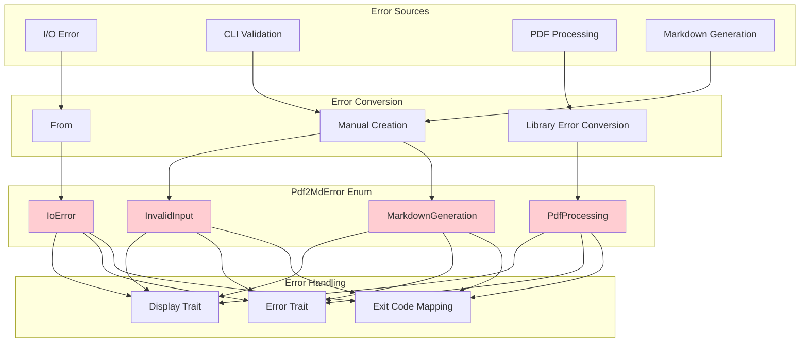
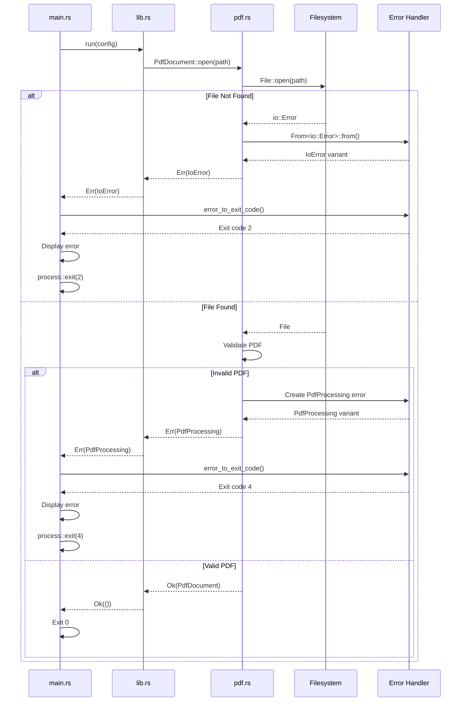

# Error Handling Component

The Error Handling component defines custom error types, provides error conversion from external libraries, and manages error propagation throughout the application.

## File

**`src/error.rs`** - Error types and handling

## Responsibilities

1. **Error Type Definition** - Define custom error enum
2. **Error Conversion** - Convert external errors to internal types
3. **User-Friendly Messages** - Provide clear error messages
4. **Exit Code Mapping** - Map errors to appropriate exit codes
5. **Error Propagation** - Enable `?` operator for error handling

## Architecture



## Error Types

### Pdf2MdError Enum

The main error type for the application:

```rust
#[derive(Debug)]
pub enum Pdf2MdError {
    /// Invalid input arguments or file paths
    InvalidInput(String),

    /// Error reading or processing PDF
    PdfProcessing(String),

    /// Error generating Markdown
    MarkdownGeneration(String),

    /// I/O error
    IoError(std::io::Error),
}
```

**Variants**:

| Variant | Description | Exit Code | Example |
|---------|-------------|-----------|---------|
| `InvalidInput` | Invalid arguments or paths | 1 | "Input file does not exist" |
| `PdfProcessing` | PDF parsing or extraction error | 4 | "Invalid PDF format" |
| `MarkdownGeneration` | Markdown formatting error | 3 | "Cannot format content" |
| `IoError` | Filesystem I/O error | 2 | "Permission denied" |

### Result Type Alias

Convenience type alias:

```rust
pub type Result<T> = std::result::Result<T, Pdf2MdError>;
```

**Usage**:
```rust
pub fn process_pdf(path: &Path) -> Result<ExtractedContent> {
    // Returns Result<ExtractedContent, Pdf2MdError>
}
```

## Error Display

### Display Trait Implementation

Provides user-friendly error messages:

```rust
impl fmt::Display for Pdf2MdError {
    fn fmt(&self, f: &mut fmt::Formatter<'_>) -> fmt::Result {
        match self {
            Self::InvalidInput(msg) => write!(f, "Invalid input: {}", msg),
            Self::PdfProcessing(msg) => write!(f, "PDF processing error: {}", msg),
            Self::MarkdownGeneration(msg) => write!(f, "Markdown generation error: {}", msg),
            Self::IoError(e) => write!(f, "I/O error: {}", e),
        }
    }
}
```

**Example Outputs**:
- `Invalid input: Input file does not exist: missing.pdf`
- `PDF processing error: File is not a valid PDF (missing PDF header)`
- `I/O error: Permission denied (os error 13)`

### Error Trait Implementation

Makes Pdf2MdError a proper error type:

```rust
impl std::error::Error for Pdf2MdError {
    fn source(&self) -> Option<&(dyn std::error::Error + 'static)> {
        match self {
            Self::IoError(e) => Some(e),
            _ => None,
        }
    }
}
```

**Purpose**:
- Enables error chaining
- Allows accessing underlying I/O errors
- Integrates with Rust error handling ecosystem

## Error Conversion

### From I/O Errors

Automatic conversion from `std::io::Error`:

```rust
impl From<std::io::Error> for Pdf2MdError {
    fn from(error: std::io::Error) -> Self {
        Self::IoError(error)
    }
}
```

**Enables**:
```rust
pub fn read_file(path: &Path) -> Result<Vec<u8>> {
    let mut file = File::open(path)?;  // Auto-converts io::Error
    let mut buffer = Vec::new();
    file.read_to_end(&mut buffer)?;    // Auto-converts io::Error
    Ok(buffer)
}
```

### From PDF Library Errors

Example conversion (depends on PDF library):

```rust
impl From<lopdf::Error> for Pdf2MdError {
    fn from(error: lopdf::Error) -> Self {
        Self::PdfProcessing(error.to_string())
    }
}
```

### Manual Error Creation

For domain-specific errors:

```rust
// Invalid input
return Err(Pdf2MdError::InvalidInput(
    format!("Input file does not exist: {}", path.display())
));

// PDF processing error
return Err(Pdf2MdError::PdfProcessing(
    "PDF contains no extractable text".to_string()
));

// Markdown generation error
return Err(Pdf2MdError::MarkdownGeneration(
    "Failed to format heading".to_string()
));
```

## Exit Code Mapping

Maps error types to process exit codes:

```rust
pub fn error_to_exit_code(error: &Pdf2MdError) -> i32 {
    match error {
        Pdf2MdError::InvalidInput(_) => 1,
        Pdf2MdError::IoError(_) => 2,
        Pdf2MdError::MarkdownGeneration(_) => 3,
        Pdf2MdError::PdfProcessing(_) => 4,
    }
}
```

**Exit Codes**:
- `0` - Success (not an error)
- `1` - Invalid input/arguments
- `2` - I/O error (file system issues)
- `3` - Markdown generation error
- `4` - PDF processing error

**Used In**:
```rust
// src/main.rs
if let Err(e) = run(config) {
    eprintln!("Error: {}", e);
    let exit_code = error_to_exit_code(&e);
    process::exit(exit_code);
}
```

## Error Propagation Flow



## Common Error Patterns

### Configuration Validation Errors

```rust
// Input file doesn't exist
Err(Pdf2MdError::InvalidInput(
    format!("Input file does not exist: {}", path.display())
))

// Input is directory, not file
Err(Pdf2MdError::InvalidInput(
    format!("Input path is not a file: {}", path.display())
))

// Output directory doesn't exist
Err(Pdf2MdError::InvalidInput(
    format!("Output directory does not exist: {}", parent.display())
))
```

### PDF Processing Errors

```rust
// Invalid PDF header
Err(Pdf2MdError::PdfProcessing(
    "File is not a valid PDF (missing PDF header)".to_string()
))

// Corrupt PDF
Err(Pdf2MdError::PdfProcessing(
    "PDF file is corrupted or malformed".to_string()
))

// No extractable text
Err(Pdf2MdError::PdfProcessing(
    "PDF contains no extractable text (may be scanned images)".to_string()
))
```

### I/O Errors

```rust
// Automatic conversion from io::Error
let file = File::open(path)?;  // Converts to IoError variant

// Permission denied
// Results in: "I/O error: Permission denied (os error 13)"

// Disk full
// Results in: "I/O error: No space left on device (os error 28)"
```

## Error Context and Messages

### Best Practices

1. **Include Context**
   ```rust
   // Good: Includes path
   format!("Input file does not exist: {}", path.display())

   // Bad: Generic message
   "File not found".to_string()
   ```

2. **Suggest Solutions**
   ```rust
   // Good: Suggests what to do
   "PDF contains no extractable text (may be scanned images)"

   // Bad: Just states problem
   "No text found"
   ```

3. **Avoid Technical Jargon**
   ```rust
   // Good: User-friendly
   "Cannot write to file: Permission denied"

   // Bad: Too technical
   "EACCES: errno 13 on write syscall"
   ```

4. **Don't Expose Internal Details**
   ```rust
   // Good: Safe message
   "PDF processing error: Invalid format"

   // Bad: Exposes internals
   "Panic in parser thread: stack overflow at 0x7fff..."
   ```

## Testing

### Unit Tests

Located in `src/error.rs`:

```rust
#[cfg(test)]
mod tests {
    use super::*;

    #[test]
    fn test_error_display() {
        let error = Pdf2MdError::InvalidInput("test error".to_string());
        assert_eq!(error.to_string(), "Invalid input: test error");
    }

    #[test]
    fn test_io_error_conversion() {
        let io_err = std::io::Error::new(
            std::io::ErrorKind::NotFound,
            "file not found"
        );
        let pdf_err: Pdf2MdError = io_err.into();

        match pdf_err {
            Pdf2MdError::IoError(_) => {},
            _ => panic!("Expected IoError variant"),
        }
    }

    #[test]
    fn test_exit_codes() {
        assert_eq!(
            error_to_exit_code(&Pdf2MdError::InvalidInput("".to_string())),
            1
        );
        assert_eq!(
            error_to_exit_code(&Pdf2MdError::IoError(
                std::io::Error::new(std::io::ErrorKind::Other, "")
            )),
            2
        );
        assert_eq!(
            error_to_exit_code(&Pdf2MdError::MarkdownGeneration("".to_string())),
            3
        );
        assert_eq!(
            error_to_exit_code(&Pdf2MdError::PdfProcessing("".to_string())),
            4
        );
    }

    #[test]
    fn test_error_source() {
        let io_err = std::io::Error::new(
            std::io::ErrorKind::NotFound,
            "file not found"
        );
        let pdf_err = Pdf2MdError::IoError(io_err);

        assert!(pdf_err.source().is_some());
    }
}
```

### Integration Tests

Test error handling in real scenarios:

```rust
#[test]
fn test_missing_input_file() {
    let mut cmd = Command::cargo_bin("pdf2md").unwrap();
    cmd.arg("-i")
        .arg("nonexistent.pdf")
        .arg("-o")
        .arg("output.md")
        .assert()
        .failure()
        .code(1)
        .stderr(predicate::str::contains("Input file does not exist"));
}

#[test]
fn test_invalid_pdf_format() {
    let mut cmd = Command::cargo_bin("pdf2md").unwrap();
    cmd.arg("-i")
        .arg("tests/fixtures/not_a_pdf.txt")
        .arg("-o")
        .arg("output.md")
        .assert()
        .failure()
        .code(4)
        .stderr(predicate::str::contains("PDF processing error"));
}
```

## Design Decisions

### Why Custom Error Type?

**Domain-Specific Errors**:
- Tailored to application needs
- Clear error categories
- User-friendly messages

**Exit Code Mapping**:
- Different errors need different exit codes
- Custom enum makes mapping explicit

### Why Not anyhow or thiserror?

**Simple Application**:
- Only 4 error types
- Manual implementation is straightforward
- No need for complex error handling crates

**Learning and Control**:
- Full control over error representation
- Educational value in manual implementation
- No external dependencies for errors

*Note: For larger projects, `thiserror` is recommended*

### Why Separate Result Type Alias?

**Convenience**:
```rust
// With alias
pub fn process() -> Result<Content>

// Without alias
pub fn process() -> std::result::Result<Content, Pdf2MdError>
```

**Consistency**:
- All functions use same Result type
- Easier to change error type if needed

## Future Enhancements

### Error Codes

Add error codes for programmatic handling:

```rust
#[derive(Debug)]
pub enum Pdf2MdError {
    InvalidInput {
        message: String,
        code: ErrorCode,
    },
    // ... other variants
}

pub enum ErrorCode {
    InputNotFound,
    InputNotFile,
    OutputDirMissing,
    // ...
}
```

### Error Context

Add context to errors:

```rust
use std::backtrace::Backtrace;

#[derive(Debug)]
pub struct Pdf2MdError {
    kind: ErrorKind,
    message: String,
    context: Vec<String>,
    backtrace: Backtrace,
}

impl Pdf2MdError {
    pub fn add_context(mut self, ctx: impl Into<String>) -> Self {
        self.context.push(ctx.into());
        self
    }
}

// Usage:
let result = process_pdf(path)
    .map_err(|e| e.add_context(format!("While processing {}", path.display())))?;
```

### Structured Errors

Support structured error output:

```rust
impl Pdf2MdError {
    pub fn to_json(&self) -> String {
        serde_json::json!({
            "error": self.kind(),
            "message": self.to_string(),
            "code": self.code(),
        }).to_string()
    }
}
```

## Related Pages

- **[[CLI-Component]]** - Error display to users
- **[[Configuration-Component]]** - Input validation errors
- **[[PDF-Processing-Component]]** - PDF processing errors
- **[[Markdown-Generation-Component]]** - I/O errors
- **[[Architecture-Overview]]** - Error handling strategy
- **[[Data-Flow-Sequences]]** - Error propagation flow
- **[[Testing-Strategy]]** - Error testing approaches

## Reference Documentation

- [Design Document](../../blob/main/docs/design.md)
- [Architecture Document](../../blob/main/docs/architecture.md)
- [Rust Error Handling](https://doc.rust-lang.org/book/ch09-00-error-handling.html)
- [std::error::Error Trait](https://doc.rust-lang.org/std/error/trait.Error.html)
