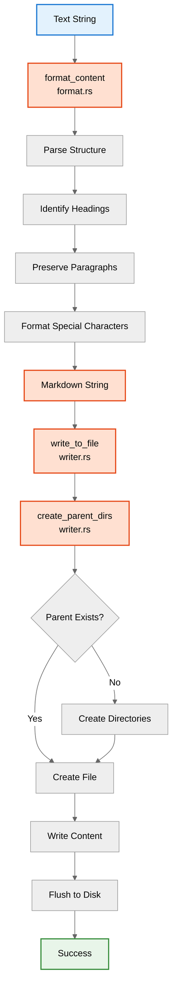
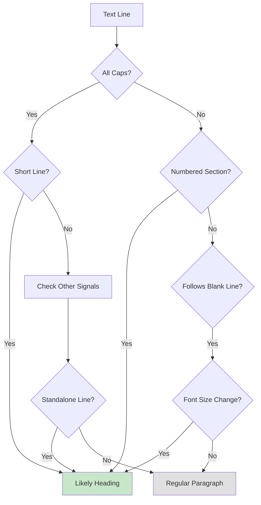
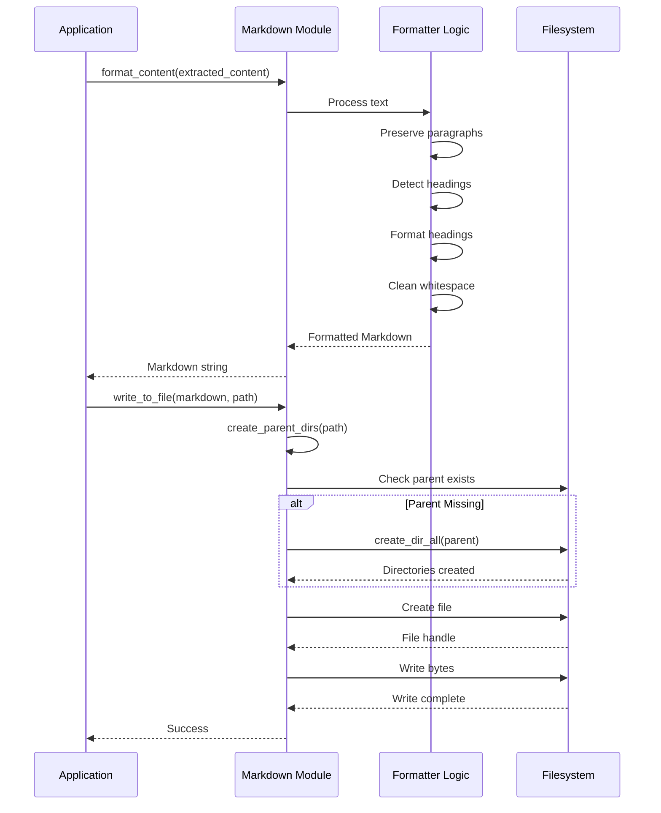

# Markdown Generation Component

The Markdown Generation component is a standalone library crate responsible for formatting text content as Markdown and writing it to output files.

## Location

**`crates/markdown-gen/`** - Markdown generation library crate

## Modules

- `format.rs` - Content formatting functions
- `writer.rs` - File I/O and directory creation

## Responsibilities

1. **Content Formatting** - Convert extracted text to Markdown format
2. **Structure Preservation** - Maintain document structure (headings, paragraphs)
3. **File Writing** - Write formatted Markdown to output file
4. **Directory Management** - Create parent directories as needed
5. **Output Validation** - Ensure output is written successfully

## Architecture



## Core Functions

### format_content

Formats text content as Markdown (generic, not PDF-specific):

```rust
pub fn format_content(text: &str) -> String {
    debug!("Formatting content as Markdown");

    // Preserve paragraph breaks
    // Detect and format headings
    // Escape special Markdown characters if needed
    // Maintain whitespace structure

    formatted_text
}
```

**Note**: This function is generic and works with any text input, not just PDF-extracted content. This makes the markdown-gen crate reusable for other text-to-markdown workflows.

**Processing Steps**:
1. **Preserve Paragraphs** - Keep paragraph breaks from PDF
2. **Detect Headings** - Identify section headings by:
   - Font size changes
   - All-caps text
   - Numbered sections
3. **Format Headings** - Convert to Markdown heading syntax (`#`, `##`, etc.)
4. **Handle Special Characters** - Escape Markdown special chars if needed
5. **Normalize Whitespace** - Clean up excessive whitespace

**Example Transformation**:

Input (from PDF):
```
INTRODUCTION

This is the first paragraph.

This is the second paragraph.

Getting Started

Follow these steps...
```

Output (Markdown):
```markdown
# INTRODUCTION

This is the first paragraph.

This is the second paragraph.

## Getting Started

Follow these steps...
```

### write_to_file

Writes Markdown content to a file:

```rust
pub fn write_to_file(markdown: &str, path: &Path) -> Result<()> {
    info!("Writing Markdown to: {}", path.display());

    // Create parent directories if needed
    create_parent_dirs(path)?;

    // Write file
    let mut file = File::create(path)?;
    file.write_all(markdown.as_bytes())?;

    info!("Successfully wrote {} bytes", markdown.len());
    Ok(())
}
```

**Process**:
1. Log output path
2. Create parent directories
3. Create output file
4. Write Markdown content as UTF-8 bytes
5. Log success with byte count

### create_parent_dirs

Creates parent directories for the output file:

```rust
pub fn create_parent_dirs(path: &Path) -> Result<()> {
    if let Some(parent) = path.parent() {
        if !parent.as_os_str().is_empty() && !parent.exists() {
            debug!("Creating parent directories: {}", parent.display());
            fs::create_dir_all(parent)?;
        }
    }
    Ok(())
}
```

**Logic**:
1. Get parent directory from path
2. Check if parent is non-empty and doesn't exist
3. Create all parent directories recursively
4. No-op if parent already exists

**Examples**:
- `output.md` -> No parent directory needed (current dir)
- `docs/output.md` -> Create `docs/` if it doesn't exist
- `docs/guide/chapter1.md` -> Create `docs/guide/` if it doesn't exist

## Formatting Strategies

### Heading Detection

Multiple strategies for detecting headings:



**Heading Indicators**:
1. **All caps** + Short line (< 80 chars)
2. **Numbered sections** (e.g., "1. Introduction", "1.1 Overview")
3. **Font size changes** (requires PDF metadata)
4. **Standalone lines** (line before and after are blank)

### Paragraph Preservation

```rust
fn preserve_paragraphs(text: &str) -> String {
    // Replace single newlines with spaces (merge lines)
    // Preserve double newlines as paragraph breaks
    // Trim excessive whitespace

    text.split("\n\n")
        .map(|para| para.replace('\n', ' ').trim())
        .collect::<Vec<_>>()
        .join("\n\n")
}
```

**Rules**:
- Single newline -> Join lines (PDFs often break mid-sentence)
- Double newline -> Paragraph break
- Multiple newlines -> Collapse to double newline

### Special Character Handling

Markdown special characters that may need escaping:

| Character | Purpose | Handling |
|-----------|---------|----------|
| `#` | Heading | Escape if not heading |
| `*` | Emphasis | Escape if literal |
| `_` | Emphasis | Escape if literal |
| `[` `]` | Links | Escape if not link |
| `` ` `` | Code | Escape if not code |
| `>` | Blockquote | Escape if not quote |

**Current Strategy**: Minimal escaping
- Preserve most characters as-is
- Only escape when it breaks Markdown rendering

## Data Flow



## Error Handling

### Common Errors

1. **Output Directory Creation Failed**
```rust
Err(Pdf2MdError::IoError(
    io::Error::new(ErrorKind::PermissionDenied, "Cannot create directory")
))
```

2. **File Write Permission Denied**
```rust
Err(Pdf2MdError::IoError(
    io::Error::new(ErrorKind::PermissionDenied, "Cannot write to file")
))
```

3. **Disk Full**
```rust
Err(Pdf2MdError::IoError(
    io::Error::new(ErrorKind::Other, "No space left on device")
))
```

### Error Conversion

All I/O errors are automatically converted:

```rust
impl From<std::io::Error> for Pdf2MdError {
    fn from(error: std::io::Error) -> Self {
        Self::IoError(error)
    }
}
```

This allows using `?` operator:
```rust
file.write_all(markdown.as_bytes())?;
```

## Testing

### Unit Tests

Located in `src/markdown.rs`:

```rust
#[cfg(test)]
mod tests {
    use super::*;
    use tempfile::TempDir;

    #[test]
    fn test_format_content() {
        let content = ExtractedContent {
            text: "HEADING\n\nParagraph text.".to_string(),
            page_count: 1,
        };

        let markdown = format_content(&content);
        assert!(markdown.contains("# HEADING"));
        assert!(markdown.contains("Paragraph text."));
    }

    #[test]
    fn test_write_to_file() {
        let temp_dir = TempDir::new().unwrap();
        let path = temp_dir.path().join("output.md");
        let markdown = "# Test\n\nContent.";

        let result = write_to_file(markdown, &path);
        assert!(result.is_ok());
        assert!(path.exists());

        let content = fs::read_to_string(path).unwrap();
        assert_eq!(content, markdown);
    }

    #[test]
    fn test_create_parent_dirs() {
        let temp_dir = TempDir::new().unwrap();
        let path = temp_dir.path().join("sub/dir/file.md");

        let result = create_parent_dirs(&path);
        assert!(result.is_ok());
        assert!(path.parent().unwrap().exists());
    }
}
```

### Integration Tests

Test complete workflows in `tests/integration_test.rs`:

```rust
#[test]
fn test_output_file_created() {
    let temp_dir = TempDir::new().unwrap();
    let output = temp_dir.path().join("output.md");

    Command::cargo_bin("pdf2md")
        .unwrap()
        .arg("-i")
        .arg("tests/fixtures/sample.pdf")
        .arg("-o")
        .arg(&output)
        .assert()
        .success();

    assert!(output.exists());
}

#[test]
fn test_output_content_valid() {
    let temp_dir = TempDir::new().unwrap();
    let output = temp_dir.path().join("output.md");

    Command::cargo_bin("pdf2md")
        .unwrap()
        .arg("-i")
        .arg("tests/fixtures/sample.pdf")
        .arg("-o")
        .arg(&output)
        .assert()
        .success();

    let content = fs::read_to_string(&output).unwrap();
    assert!(!content.is_empty());
    assert!(content.contains("# ") || content.contains("##"));
}
```

## Performance Considerations

### Time Complexity

- **format_content**: O(n) where n is text length
  - Single pass through text
  - Linear with content size

- **write_to_file**: O(n) where n is content size
  - Single write operation
  - Linear with Markdown length

### Space Complexity

- **format_content**: O(n)
  - Creates new string with formatted content
  - Approximately same size as input

- **write_to_file**: O(1)
  - Streams content to file
  - Minimal additional memory

### Optimization Opportunities

1. **Streaming Output**
   ```rust
   pub fn write_to_file_streaming(
       content_iter: impl Iterator<Item = String>,
       path: &Path
   ) -> Result<()> {
       let mut file = File::create(path)?;
       for chunk in content_iter {
           file.write_all(chunk.as_bytes())?;
       }
       Ok(())
   }
   ```

2. **Parallel Formatting**
   - Split content into chunks
   - Format chunks in parallel
   - Combine results

3. **Buffered Writing**
   ```rust
   use std::io::BufWriter;

   let file = File::create(path)?;
   let mut writer = BufWriter::new(file);
   writer.write_all(markdown.as_bytes())?;
   writer.flush()?;
   ```

## Future Enhancements

### Custom Formatting Options

Support different Markdown styles:

```rust
pub enum HeadingStyle {
    Atx,        // # Heading
    Setext,     // Heading\n=======
}

pub struct MarkdownOptions {
    pub heading_style: HeadingStyle,
    pub line_length: usize,
    pub preserve_formatting: bool,
}

pub fn format_content_with_options(
    content: &ExtractedContent,
    options: &MarkdownOptions
) -> String {
    // Format with custom options
}
```

### Table Formatting

Convert PDF tables to Markdown tables:

```rust
pub fn format_table(table: &Table) -> String {
    // | Column 1 | Column 2 |
    // |----------|----------|
    // | Data 1   | Data 2   |
}
```

### Link Detection

Detect and format URLs:

```rust
pub fn detect_and_format_links(text: &str) -> String {
    // Convert "http://example.com" to "[http://example.com](http://example.com)"
    // Or: "[Link text](http://example.com)"
}
```

### Image References

Add image references for extracted images:

```rust
pub fn add_image_references(
    markdown: &str,
    images: &[Image]
) -> String {
    // Insert 
}
```

### Syntax Highlighting

Detect code blocks and add language hints:

```rust
pub fn detect_code_blocks(text: &str) -> String {
    // Convert code sections to ```language ... ```
}
```

## Dependencies

### External Crates

- **Standard Library Only**
  - `std::fs` - File operations
  - `std::io` - I/O traits and types
  - `std::path` - Path handling

### Internal Dependencies

- **`pdf`** module - `ExtractedContent` type
- **`error`** module - `Pdf2MdError` type
- **`log`** - Logging macros (`info!`, `debug!`)

## Related Pages

- **[[PDF-Processing-Component]]** - Provides ExtractedContent input
- **[[Configuration-Component]]** - Output path configuration
- **[[Error-Handling-Component]]** - I/O error handling
- **[[Data-Flow-Sequences]]** - Markdown generation sequences
- **[[Testing-Strategy]]** - Testing approaches

## Reference Documentation

- [Markdown Specification](https://commonmark.org/)
- [GitHub Flavored Markdown](https://github.github.com/gfm/)
- [Design Document](../../blob/main/docs/design.md)
- [Architecture Document](../../blob/main/docs/architecture.md)
