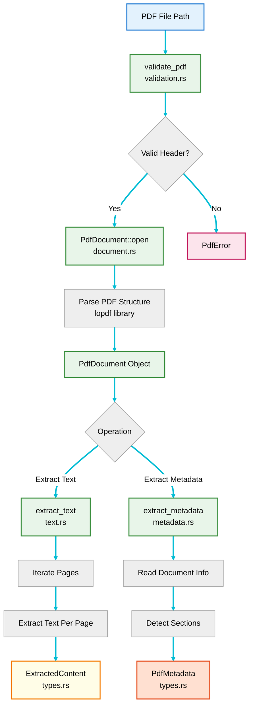

# PDF Processing Component

The PDF Processing component is a standalone library crate responsible for reading PDF files, validating their format, extracting text content, and gathering metadata.

## Location

**`crates/pdf-extract/`** - PDF processing library crate

## Modules

- `document.rs` - PdfDocument struct and implementation
- `validation.rs` - PDF format validation functions
- `text.rs` - Text extraction from PDF pages
- `metadata.rs` - Metadata extraction functions
- `types.rs` - ExtractedContent and PdfMetadata structs
- `test_utils.rs` - Test fixture utilities

## Responsibilities

1. **PDF Validation** - Verify files are valid PDFs
2. **Document Opening** - Open and parse PDF files
3. **Text Extraction** - Extract text content from all pages
4. **Metadata Extraction** - Extract document metadata (title, author, page count)
5. **Structure Analysis** - Detect sections and document structure

## Architecture



## Data Structures

### PdfDocument

Represents an opened PDF file:

```rust
#[derive(Debug)]
pub struct PdfDocument {
    path: PathBuf,
    // Internal PDF representation (library-specific)
}
```

**Methods**:
- `open(path: &Path) -> Result<PdfDocument>` - Open and validate a PDF file
- `extract_text(&self) -> Result<ExtractedContent>` - Extract all text
- `extract_metadata(&self) -> Result<PdfMetadata>` - Extract metadata

### ExtractedContent

Contains the extracted text and metadata:

```rust
#[derive(Debug, Clone)]
pub struct ExtractedContent {
    pub text: String,
    pub page_count: usize,
}
```

**Fields**:
- `text` - All extracted text from the PDF
- `page_count` - Number of pages processed

### PdfMetadata

Metadata for preview mode:

```rust
#[derive(Debug, Clone)]
pub struct PdfMetadata {
    pub page_count: usize,
    pub title: Option<String>,
    pub author: Option<String>,
    pub has_text: bool,
    pub sections: Vec<String>,
}
```

**Fields**:
- `page_count` - Total number of pages
- `title` - Document title (if available)
- `author` - Document author (if available)
- `has_text` - Whether the PDF contains extractable text
- `sections` - Detected section headings

## Core Functions

### PDF Validation

Validates that a file is a PDF by checking the header:

```rust
pub fn validate_pdf(path: &Path) -> Result<()> {
    let mut file = File::open(path)?;
    let mut header = [0u8; 5];
    file.read_exact(&mut header)?;

    if &header != b"%PDF-" {
        return Err(Pdf2MdError::PdfProcessing(
            "File is not a valid PDF (missing PDF header)".to_string()
        ));
    }

    Ok(())
}
```

**Process**:
1. Open the file
2. Read first 5 bytes
3. Check for PDF signature: `%PDF-`
4. Return error if signature missing

### Document Opening

Opens and parses a PDF file:

```rust
impl PdfDocument {
    pub fn open(path: &Path) -> Result<Self> {
        info!("Opening PDF file: {}", path.display());

        // Validate file extension
        if let Some(ext) = path.extension() {
            if ext.to_str() != Some("pdf") {
                return Err(Pdf2MdError::InvalidInput(
                    "File must have .pdf extension".to_string()
                ));
            }
        }

        // Open PDF using library
        // (Implementation depends on PDF library)

        Ok(Self {
            path: path.to_path_buf(),
        })
    }
}
```

**Validation Steps**:
1. Check file extension is `.pdf`
2. Open file with PDF library
3. Parse document structure
4. Return `PdfDocument` instance

### Text Extraction

Extracts text from all pages:

```rust
impl PdfDocument {
    pub fn extract_text(&self) -> Result<ExtractedContent> {
        info!("Extracting text from PDF");
        debug!("Processing: {}", self.path.display());

        // Extract text from each page
        // Combine all pages into single string
        // Preserve structure and formatting

        Ok(ExtractedContent {
            text: extracted_text,
            page_count: total_pages,
        })
    }
}
```

**Process**:
1. Get page count
2. Iterate through all pages
3. Extract text from each page
4. Combine into single string
5. Preserve paragraph and section structure
6. Return `ExtractedContent`

### Metadata Extraction

Extracts metadata for preview mode:

```rust
impl PdfDocument {
    pub fn extract_metadata(&self) -> Result<PdfMetadata> {
        info!("Extracting PDF metadata");
        debug!("Analyzing: {}", self.path.display());

        // Extract document info dictionary
        // Get page count
        // Detect section headings
        // Check for text content

        Ok(PdfMetadata {
            page_count: pages,
            title: doc_title,
            author: doc_author,
            has_text: contains_text,
            sections: detected_sections,
        })
    }
}
```

**Extracted Information**:
- Page count from document catalog
- Title from document info dictionary
- Author from document info dictionary
- Text availability by checking page contents
- Section headings from text analysis

## Processing Flow

### Standard Text Extraction

```mermaid
sequenceDiagram
    participant App as Application
    participant PDF as PdfDocument
    participant Parser as PDF Parser
    participant Page as Page Iterator

    App->>PDF: extract_text()
    PDF->>Parser: Get document structure
    Parser-->>PDF: Document object

    PDF->>Parser: Get page count
    Parser-->>PDF: N pages

    PDF->>Page: Create page iterator
    loop For each page (1 to N)
        Page->>Parser: Get page object
        Parser-->>Page: Page data

        Page->>Parser: Extract text objects
        Parser-->>Page: Text content

        Page->>Page: Decode text encoding
        Page->>Page: Preserve structure
        Page->>PDF: Append page text
    end

    PDF->>PDF: Combine all text
    PDF->>PDF: Create ExtractedContent
    PDF-->>App: ExtractedContent

    linkStyle default stroke:#00bcd4,stroke-width:3px
```

### Metadata Extraction

```mermaid
sequenceDiagram
    participant App as Application
    participant PDF as PdfDocument
    participant Parser as PDF Parser
    participant Info as Info Dictionary
    participant Analyzer as Text Analyzer

    App->>PDF: extract_metadata()
    PDF->>Parser: Get document catalog
    Parser-->>PDF: Catalog object

    PDF->>Parser: Get page count
    Parser-->>PDF: N pages

    PDF->>Info: Get info dictionary
    Info-->>PDF: Title, Author, etc.

    PDF->>Analyzer: Detect sections
    Analyzer->>Parser: Get first few pages
    Parser-->>Analyzer: Page content
    Analyzer->>Analyzer: Find heading patterns
    Analyzer-->>PDF: Section list

    PDF->>Parser: Check for text
    Parser-->>PDF: Has extractable text

    PDF->>PDF: Create PdfMetadata
    PDF-->>App: PdfMetadata

    linkStyle default stroke:#00bcd4,stroke-width:3px
```

## Error Handling

### Common Errors

1. **Invalid PDF Format**
```rust
Err(Pdf2MdError::PdfProcessing(
    "File is not a valid PDF (missing PDF header)".to_string()
))
```

2. **Corrupt PDF**
```rust
Err(Pdf2MdError::PdfProcessing(
    "PDF file is corrupted or malformed".to_string()
))
```

3. **No Text Content**
```rust
Err(Pdf2MdError::PdfProcessing(
    "PDF contains no extractable text (may be scanned images)".to_string()
))
```

4. **Unsupported PDF Version**
```rust
Err(Pdf2MdError::PdfProcessing(
    "PDF version not supported".to_string()
))
```

### Error Propagation

All errors are converted to `Pdf2MdError::PdfProcessing`:

```rust
impl From<PdfLibraryError> for Pdf2MdError {
    fn from(error: PdfLibraryError) -> Self {
        Self::PdfProcessing(error.to_string())
    }
}
```

## Testing

### Unit Tests

Located in `src/pdf.rs`:

```rust
#[cfg(test)]
mod tests {
    use super::*;

    #[test]
    fn test_validate_valid_pdf() {
        let path = Path::new("tests/fixtures/sample.pdf");
        assert!(validate_pdf(path).is_ok());
    }

    #[test]
    fn test_validate_invalid_pdf() {
        let path = Path::new("tests/fixtures/not_a_pdf.txt");
        assert!(validate_pdf(path).is_err());
    }

    #[test]
    fn test_open_pdf() {
        let path = Path::new("tests/fixtures/sample.pdf");
        let doc = PdfDocument::open(path);
        assert!(doc.is_ok());
    }

    #[test]
    fn test_extract_text() {
        let path = Path::new("tests/fixtures/sample.pdf");
        let doc = PdfDocument::open(path).unwrap();
        let content = doc.extract_text().unwrap();
        assert!(!content.text.is_empty());
        assert!(content.page_count > 0);
    }
}
```

### Test Fixtures

Located in `tests/fixtures/`:
- `sample.pdf` - Valid multi-page PDF
- `single_page.pdf` - Single page PDF
- `not_a_pdf.txt` - Text file (invalid PDF)
- `empty.pdf` - Valid PDF with no text
- `with_metadata.pdf` - PDF with title/author info

## Dependencies

### External Crates

PDF processing requires a PDF library. Options include:

- **`lopdf`** - Low-level PDF library
  - Pros: Full control, low-level access
  - Cons: More complex API

- **`pdf`** - Higher-level PDF library
  - Pros: Easier API
  - Cons: Less mature

- **`pdfium-render`** - Bindings to PDFium (Google's PDF library)
  - Pros: Feature-rich, well-tested
  - Cons: External dependencies

### Internal Dependencies

- **`error`** module - `Pdf2MdError` type
- **`log`** - Logging macros

## Performance Considerations

### Memory Usage

**Current Approach**:
- Loads entire PDF into memory
- Stores all extracted text in memory

**Memory Complexity**: O(n) where n is the content size

### Optimization Opportunities

1. **Streaming Processing**
   - Process pages incrementally
   - Write output progressively
   - Reduce memory footprint

2. **Parallel Processing**
   - Extract text from multiple pages in parallel
   - Use thread pool for large PDFs

3. **Caching**
   - Cache parsed PDF structure
   - Reuse for multiple operations (text + metadata)

### Performance Targets

- **Small PDFs (< 1MB)**: < 100ms extraction time
- **Medium PDFs (1-10MB)**: < 1s extraction time
- **Large PDFs (10-100MB)**: < 10s extraction time
- **Memory**: < 2x PDF file size

## Security Considerations

### Input Validation

1. **File Format Validation**
   - Check PDF signature before parsing
   - Verify file extension
   - Reject malformed PDFs early

2. **Size Limits** (Future)
   ```rust
   const MAX_PDF_SIZE: u64 = 100 * 1024 * 1024; // 100MB

   if metadata.len() > MAX_PDF_SIZE {
       return Err(Pdf2MdError::InvalidInput(
           "PDF file exceeds maximum size".to_string()
       ));
   }
   ```

3. **Resource Limits** (Future)
   - Maximum pages
   - Maximum extraction time
   - Memory limits

### Malicious PDFs

PDF files can contain:
- JavaScript
- Embedded files
- Forms
- Encryption

**Mitigation**:
- Use safe PDF parsing library
- Don't execute JavaScript
- Ignore embedded files
- Only extract text content

## Future Enhancements

### OCR Support

For scanned PDFs without text:

```rust
impl PdfDocument {
    pub fn extract_text_with_ocr(&self) -> Result<ExtractedContent> {
        // Try standard text extraction
        match self.extract_text() {
            Ok(content) if !content.text.is_empty() => Ok(content),
            _ => {
                // Fall back to OCR
                self.extract_text_via_ocr()
            }
        }
    }
}
```

### Image Extraction

Extract embedded images:

```rust
impl PdfDocument {
    pub fn extract_images(&self) -> Result<Vec<Image>> {
        // Extract images from PDF
        // Save to output directory
        // Return image metadata
    }
}
```

### Table Detection

Detect and preserve table structures:

```rust
impl PdfDocument {
    pub fn extract_tables(&self) -> Result<Vec<Table>> {
        // Detect table structures
        // Extract table data
        // Return structured table data
    }
}
```

## Related Pages

- **[[Markdown-Generation-Component]]** - Uses ExtractedContent to generate Markdown
- **[[Error-Handling-Component]]** - PDF-specific error handling
- **[[Configuration-Component]]** - Input file configuration
- **[[Data-Flow-Sequences]]** - PDF processing sequences
- **[[Testing-Strategy]]** - Testing approach for PDF processing

## Reference Documentation

- [Architecture Document](../../blob/main/docs/architecture.md)
- [Design Document](../../blob/main/docs/design.md)
- [lopdf Documentation](https://docs.rs/lopdf/) (if using lopdf)
