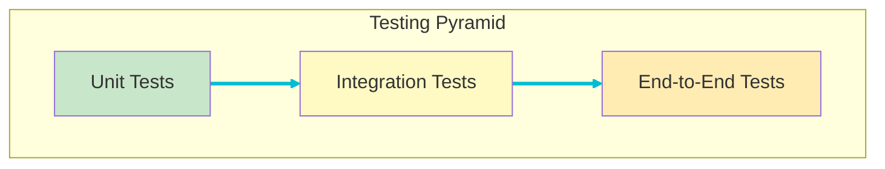
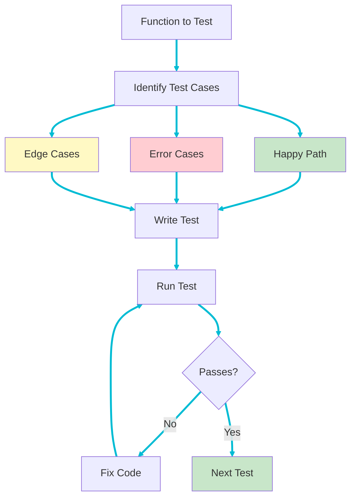
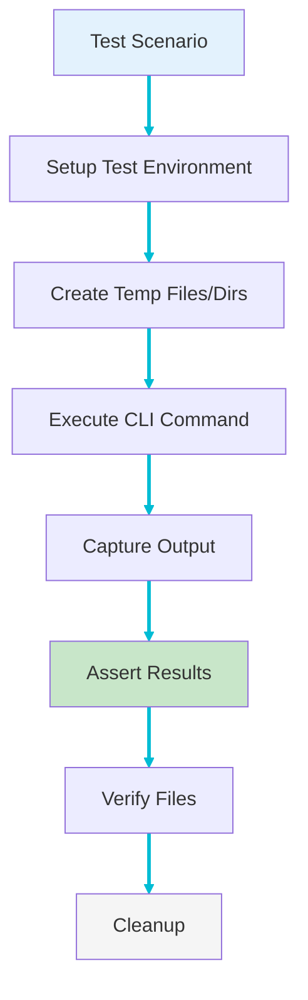
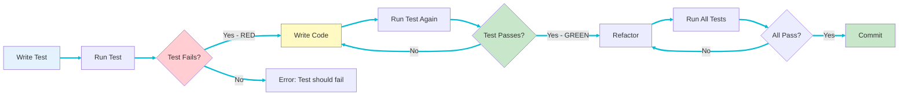

# Testing Strategy

This page describes the comprehensive testing strategy for pdf2md, including unit tests, integration tests, test-driven development practices, and quality assurance standards.

## Testing Philosophy

pdf2md follows **Test-Driven Development (TDD)** principles:

1. **Red** - Write a failing test first
2. **Green** - Write minimal code to pass the test
3. **Refactor** - Improve code while keeping tests green

## Testing Pyramid



**Distribution**:
- **Unit Tests**: ~70% - Fast, focused, numerous
- **Integration Tests**: ~20% - Medium speed, workflow testing
- **End-to-End Tests**: ~10% - Slow, complete scenarios

## Test Coverage Goals

### Overall Coverage Targets

- **Minimum**: 80% code coverage
- **Critical Paths**: 100% coverage
- **Error Handling**: All error cases tested
- **Public APIs**: All public functions tested

### Coverage by Module

| Module | Target | Priority | Notes |
|--------|--------|----------|-------|
| `error.rs` | 100% | Critical | All error types and conversions |
| `config.rs` | 100% | Critical | All validation paths |
| `cli.rs` | 90% | High | Argument parsing logic |
| `pdf.rs` | 85% | High | Core processing logic |
| `markdown.rs` | 85% | High | Formatting and I/O |
| `lib.rs` | 90% | High | Orchestration logic |
| `main.rs` | 50% | Medium | Tested via integration tests |

## Unit Tests

### Location

Each module contains its own unit tests in a `#[cfg(test)]` module:

```rust
// src/config.rs
#[cfg(test)]
mod tests {
    use super::*;

    #[test]
    fn test_config_validation() {
        // Test code
    }
}
```

### Unit Test Strategy



### Example Unit Tests

#### Configuration Module

```rust
#[cfg(test)]
mod tests {
    use super::*;
    use tempfile::TempDir;
    use std::fs::File;

    #[test]
    fn test_validate_valid_input() {
        let temp_dir = TempDir::new().unwrap();
        let input = temp_dir.path().join("test.pdf");
        File::create(&input).unwrap();

        let result = validate_input_path(&input);
        assert!(result.is_ok());
    }

    #[test]
    fn test_validate_missing_input() {
        let path = PathBuf::from("nonexistent.pdf");
        let result = validate_input_path(&path);

        assert!(result.is_err());
        assert!(result.unwrap_err().to_string().contains("does not exist"));
    }

    #[test]
    fn test_validate_input_is_directory() {
        let temp_dir = TempDir::new().unwrap();
        let result = validate_input_path(temp_dir.path());

        assert!(result.is_err());
        assert!(result.unwrap_err().to_string().contains("not a file"));
    }
}
```

#### Error Module

```rust
#[cfg(test)]
mod tests {
    use super::*;

    #[test]
    fn test_error_display_invalid_input() {
        let error = Pdf2MdError::InvalidInput("test message".to_string());
        assert_eq!(error.to_string(), "Invalid input: test message");
    }

    #[test]
    fn test_io_error_conversion() {
        let io_err = std::io::Error::new(ErrorKind::NotFound, "not found");
        let pdf_err: Pdf2MdError = io_err.into();

        match pdf_err {
            Pdf2MdError::IoError(_) => {},
            _ => panic!("Expected IoError variant"),
        }
    }

    #[test]
    fn test_all_exit_codes() {
        assert_eq!(error_to_exit_code(&Pdf2MdError::InvalidInput("".into())), 1);
        assert_eq!(error_to_exit_code(&Pdf2MdError::IoError(
            std::io::Error::new(ErrorKind::Other, "")
        )), 2);
        assert_eq!(error_to_exit_code(&Pdf2MdError::MarkdownGeneration("".into())), 3);
        assert_eq!(error_to_exit_code(&Pdf2MdError::PdfProcessing("".into())), 4);
    }
}
```

#### PDF Module

```rust
#[cfg(test)]
mod tests {
    use super::*;

    #[test]
    fn test_validate_pdf_valid() {
        let path = Path::new("tests/fixtures/sample.pdf");
        assert!(validate_pdf(path).is_ok());
    }

    #[test]
    fn test_validate_pdf_invalid() {
        let path = Path::new("tests/fixtures/not_a_pdf.txt");
        let result = validate_pdf(path);

        assert!(result.is_err());
        assert!(result.unwrap_err().to_string().contains("not a valid PDF"));
    }

    #[test]
    fn test_open_pdf() {
        let path = Path::new("tests/fixtures/sample.pdf");
        let doc = PdfDocument::open(path);
        assert!(doc.is_ok());
    }

    #[test]
    fn test_extract_text_non_empty() {
        let path = Path::new("tests/fixtures/sample.pdf");
        let doc = PdfDocument::open(path).unwrap();
        let content = doc.extract_text().unwrap();

        assert!(!content.text.is_empty());
        assert!(content.page_count > 0);
    }
}
```

## Integration Tests

### Location

Integration tests are in `tests/` directory:

```
tests/
+-- integration_test.rs
+-- fixtures/
    +-- sample.pdf
    +-- single_page.pdf
    +-- not_a_pdf.txt
    +-- empty.pdf
```

### Integration Test Dependencies

```toml
[dev-dependencies]
assert_cmd = "2.0"      # CLI testing
predicates = "3.0"       # Assertions
tempfile = "3.8"         # Temporary files/dirs
```

### Integration Test Strategy



### Example Integration Tests

#### CLI Tests

```rust
use assert_cmd::Command;
use predicates::prelude::*;

#[test]
fn test_help_flag() {
    let mut cmd = Command::cargo_bin("pdf2md").unwrap();
    cmd.arg("--help")
        .assert()
        .success()
        .stdout(predicate::str::contains("Convert PDF documents to Markdown"));
}

#[test]
fn test_version_flag() {
    let mut cmd = Command::cargo_bin("pdf2md").unwrap();
    cmd.arg("--version")
        .assert()
        .success()
        .stdout(predicate::str::contains(env!("CARGO_PKG_VERSION")));
}

#[test]
fn test_missing_required_args() {
    let mut cmd = Command::cargo_bin("pdf2md").unwrap();
    cmd.assert()
        .failure()
        .stderr(predicate::str::contains("required arguments"));
}
```

#### Workflow Tests

```rust
use tempfile::TempDir;
use std::fs;

#[test]
fn test_successful_conversion() {
    let temp_dir = TempDir::new().unwrap();
    let output = temp_dir.path().join("output.md");

    let mut cmd = Command::cargo_bin("pdf2md").unwrap();
    cmd.arg("-i")
        .arg("tests/fixtures/sample.pdf")
        .arg("-o")
        .arg(&output)
        .assert()
        .success();

    assert!(output.exists());
    let content = fs::read_to_string(&output).unwrap();
    assert!(!content.is_empty());
}

#[test]
fn test_verbose_mode() {
    let temp_dir = TempDir::new().unwrap();
    let output = temp_dir.path().join("output.md");

    let mut cmd = Command::cargo_bin("pdf2md").unwrap();
    cmd.arg("-i")
        .arg("tests/fixtures/sample.pdf")
        .arg("-o")
        .arg(&output)
        .arg("--verbose")
        .assert()
        .success()
        .stderr(predicate::str::contains("Starting pdf2md"))
        .stderr(predicate::str::contains("Conversion complete"));
}

#[test]
fn test_dry_run_mode() {
    let mut cmd = Command::cargo_bin("pdf2md").unwrap();
    cmd.arg("-i")
        .arg("tests/fixtures/sample.pdf")
        .arg("-o")
        .arg("output.md")
        .arg("--dry-run")
        .assert()
        .success()
        .stdout(predicate::str::contains("=== PDF Preview ==="))
        .stdout(predicate::str::contains("Pages:"));
}
```

#### Error Handling Tests

```rust
#[test]
fn test_input_file_not_found() {
    let mut cmd = Command::cargo_bin("pdf2md").unwrap();
    cmd.arg("-i")
        .arg("nonexistent.pdf")
        .arg("-o")
        .arg("output.md")
        .assert()
        .failure()
        .code(1)
        .stderr(predicate::str::contains("Input file does not exist"));
}

#[test]
fn test_invalid_pdf_format() {
    let temp_dir = TempDir::new().unwrap();
    let output = temp_dir.path().join("output.md");

    let mut cmd = Command::cargo_bin("pdf2md").unwrap();
    cmd.arg("-i")
        .arg("tests/fixtures/not_a_pdf.txt")
        .arg("-o")
        .arg(&output)
        .assert()
        .failure()
        .code(4)
        .stderr(predicate::str::contains("PDF processing error"));
}

#[test]
fn test_output_directory_missing() {
    let mut cmd = Command::cargo_bin("pdf2md").unwrap();
    cmd.arg("-i")
        .arg("tests/fixtures/sample.pdf")
        .arg("-o")
        .arg("nonexistent/dir/output.md")
        .assert()
        .failure()
        .code(1)
        .stderr(predicate::str::contains("directory does not exist"));
}
```

## Test Fixtures

### PDF Test Files

Located in `tests/fixtures/`:

| File | Description | Purpose |
|------|-------------|---------|
| `sample.pdf` | Multi-page PDF with text | Standard conversion test |
| `single_page.pdf` | One-page PDF | Edge case testing |
| `with_metadata.pdf` | PDF with title/author | Metadata extraction test |
| `empty.pdf` | Valid PDF, no text | Empty content handling |
| `not_a_pdf.txt` | Text file | Invalid format testing |
| `large.pdf` | Large multi-page PDF | Performance testing |

### Creating Test Fixtures

```rust
// Helper to create test PDFs
fn create_test_pdf(path: &Path, content: &str) -> Result<()> {
    // Create minimal PDF with content
    // Used in tests that need custom PDFs
}
```

## Test-Driven Development Workflow

### TDD Cycle



### TDD Example

**Feature**: Validate input file exists

**Step 1: Write Test (RED)**
```rust
#[test]
fn test_validate_missing_input() {
    let path = PathBuf::from("nonexistent.pdf");
    let result = validate_input_path(&path);
    assert!(result.is_err());
}
```

Run: `cargo test` -> Test fails (function doesn't exist)

**Step 2: Write Code (GREEN)**
```rust
fn validate_input_path(path: &Path) -> Result<()> {
    if !path.exists() {
        return Err(Pdf2MdError::InvalidInput(
            format!("Input file does not exist: {}", path.display())
        ));
    }
    Ok(())
}
```

Run: `cargo test` -> Test passes

**Step 3: Refactor**
- Extract error message to const
- Add logging
- Improve error context

Run: `cargo test` -> All tests still pass

**Step 4: Commit**
```bash
git add .
git commit -m "Add input file validation"
```

## Quality Gates

### Pre-Commit Checks

All checks must pass before committing:

```bash
# 1. Format code
cargo fmt

# 2. Lint (no warnings allowed)
cargo clippy -- -D warnings

# 3. Build (no warnings)
cargo build --release

# 4. Run tests
cargo test

# 5. Check documentation
cargo doc --no-deps
```

### Continuous Integration

GitHub Actions workflow (`.github/workflows/ci.yml`):

```yaml
name: CI

on: [push, pull_request]

jobs:
  test:
    runs-on: ubuntu-latest
    steps:
      - uses: actions/checkout@v2
      - uses: actions-rs/toolchain@v1
        with:
          toolchain: stable
      - name: Format check
        run: cargo fmt -- --check
      - name: Clippy
        run: cargo clippy -- -D warnings
      - name: Build
        run: cargo build --release
      - name: Test
        run: cargo test
      - name: Coverage
        run: cargo tarpaulin --out Html
```

## Coverage Reporting

### Using cargo-tarpaulin

Install:
```bash
cargo install cargo-tarpaulin
```

Run coverage:
```bash
cargo tarpaulin --out Html --output-dir coverage
```

View report: `open coverage/index.html`

### Coverage Requirements

- **Overall**: >= 80%
- **Critical modules**: >= 90%
- **Error handling**: 100%

### Coverage Report Example

```
|| Tested/Total Lines:
|| src/config.rs: 45/45 (100%)
|| src/error.rs: 32/32 (100%)
|| src/cli.rs: 28/30 (93.3%)
|| src/pdf.rs: 67/78 (85.9%)
|| src/markdown.rs: 52/60 (86.7%)
|| src/lib.rs: 38/42 (90.5%)
||
|| Total: 262/287 (91.3%)
```

## Testing Best Practices

### 1. Test Names

Use descriptive names:

```rust
// Good
#[test]
fn test_validate_input_file_not_found()

// Bad
#[test]
fn test1()
```

### 2. Arrange-Act-Assert

Structure tests clearly:

```rust
#[test]
fn test_example() {
    // Arrange - Set up test data
    let input = "test data";

    // Act - Perform action
    let result = function_under_test(input);

    // Assert - Verify result
    assert_eq!(result, expected);
}
```

### 3. One Assertion Per Test

Focus each test:

```rust
// Good - One concern
#[test]
fn test_file_exists() {
    let path = create_test_file();
    assert!(path.exists());
}

#[test]
fn test_file_readable() {
    let path = create_test_file();
    assert!(File::open(&path).is_ok());
}

// Bad - Multiple concerns
#[test]
fn test_file() {
    let path = create_test_file();
    assert!(path.exists());
    assert!(File::open(&path).is_ok());
    assert_eq!(path.extension(), Some("pdf"));
}
```

### 4. Test Independence

Each test should be independent:

```rust
// Good - Independent
#[test]
fn test_a() {
    let temp_dir = TempDir::new().unwrap();
    // Test logic
}

#[test]
fn test_b() {
    let temp_dir = TempDir::new().unwrap();
    // Test logic
}

// Bad - Shared state
static mut SHARED: Option<TempDir> = None;

#[test]
fn test_a() {
    unsafe { SHARED = Some(TempDir::new().unwrap()); }
}

#[test]
fn test_b() {
    // Depends on test_a
}
```

### 5. Use Test Helpers

Extract common setup:

```rust
#[cfg(test)]
mod test_helpers {
    pub fn create_test_config() -> Config {
        Config {
            input_path: PathBuf::from("test.pdf"),
            output_path: PathBuf::from("output.md"),
            verbose: false,
            dry_run: false,
        }
    }
}

#[test]
fn test_with_helper() {
    let config = test_helpers::create_test_config();
    // Test logic
}
```

## Performance Testing

### Benchmark Tests

```rust
#[cfg(test)]
mod benches {
    use super::*;
    use std::time::Instant;

    #[test]
    fn bench_pdf_extraction() {
        let path = Path::new("tests/fixtures/large.pdf");
        let doc = PdfDocument::open(path).unwrap();

        let start = Instant::now();
        let _content = doc.extract_text().unwrap();
        let duration = start.elapsed();

        assert!(duration.as_secs() < 5, "Extraction too slow: {:?}", duration);
    }
}
```

### Performance Targets

- **Small PDF (< 1MB)**: < 500ms
- **Medium PDF (1-10MB)**: < 5s
- **Large PDF (10-100MB)**: < 60s

## Related Pages

- **[[Development-Process]]** - TDD methodology and workflow
- **[[CLI-Component]]** - CLI testing examples
- **[[PDF-Processing-Component]]** - PDF processing tests
- **[[Markdown-Generation-Component]]** - Markdown generation tests
- **[[Error-Handling-Component]]** - Error handling tests
- **[[Architecture-Overview]]** - Testing architecture

## Reference Documentation

- [Development Process](../../blob/main/docs/process.md) - Full TDD process
- [Rust Testing Guide](https://doc.rust-lang.org/book/ch11-00-testing.html)
- [assert_cmd Documentation](https://docs.rs/assert_cmd/)
- [cargo-tarpaulin](https://github.com/xd009642/tarpaulin)
